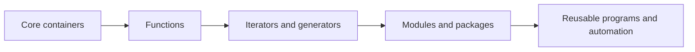
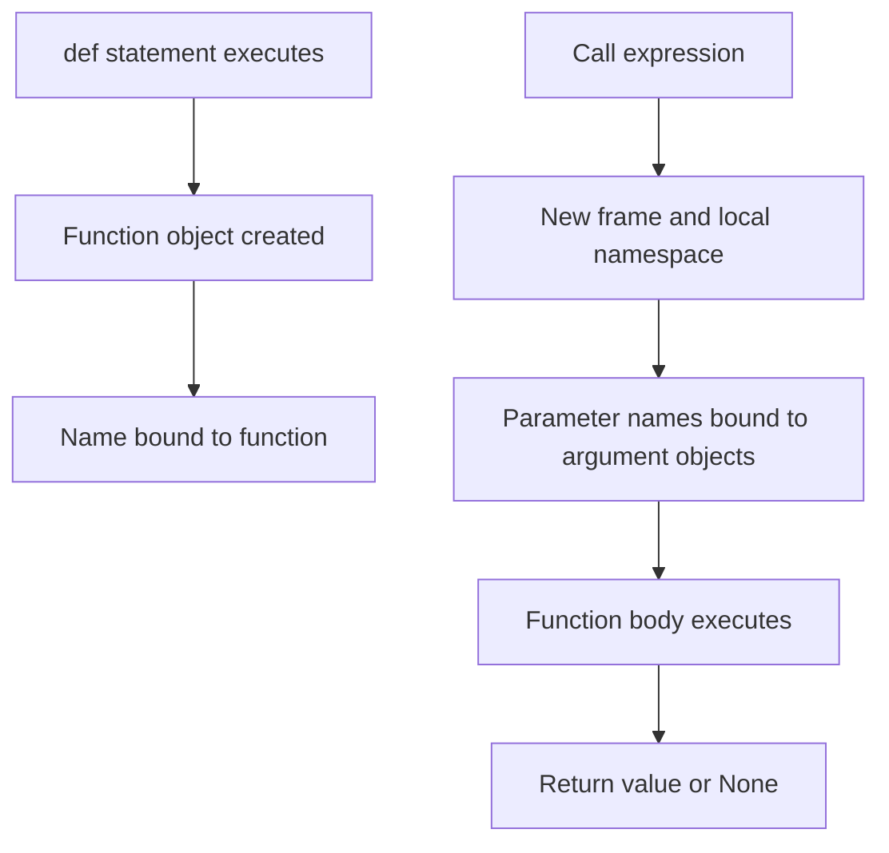

# 02 - Core Types, Functions, Iterators, and Modules

## Why This Chapter Matters

Most Python bugs in real scripts are not caused by obscure metaclasses. They are caused by shallow understanding of ordinary things: lists, dictionaries, functions, imports, iteration, decorators, and modules.

Python's core types are powerful because they compress common programming patterns into readable code. That power has costs: mutation, hashing, iteration laziness, import side effects, and function object behavior matter.

Cause -> Mechanism -> Immediate Result -> Long-Term Impact -> Next Connected Topic:

```text
automation needs concise data handling
-> Python provides rich built-in containers, functions as objects, iterators, generators, and modules
-> everyday code is short and expressive
-> correctness depends on mutability, hashing, laziness, scoping, and import discipline
-> error handling, OOP, typing, async, and automation architecture
```

Official source baseline:

- Python tutorial: <https://docs.python.org/3/tutorial/>
- Python data structures tutorial: <https://docs.python.org/3/tutorial/datastructures.html>
- Python functions tutorial: <https://docs.python.org/3/tutorial/controlflow.html#defining-functions>
- Python modules tutorial: <https://docs.python.org/3/tutorial/modules.html>
- Python data model: <https://docs.python.org/3/reference/datamodel.html>

Version assumption: checked on 2026-05-27. Examples use Python 3 syntax. Dictionary insertion order is part of modern Python language behavior, but when reading very old code or alternate contexts, always verify version assumptions.

## The Big Picture

Python gives you a small set of extremely important building blocks:

| Building block | What it solves | Main trap |
| --- | --- | --- |
| `list` | Ordered mutable sequence. | Aliasing, expensive middle insert/delete. |
| `tuple` | Fixed sequence, often record-like. | Can contain mutable objects. |
| `dict` | Key-value mapping. | Keys must be hashable; mutation while iterating. |
| `set` | Unique unordered collection. | Requires hashable elements; order is not semantic. |
| `str` | Immutable text sequence. | Repeated concatenation, encoding confusion. |
| function | Reusable behavior object. | Mutable defaults, late binding closures. |
| iterator | Pull one value at a time. | Exhaustion. |
| generator | Lazy iterator from `yield`. | One-shot behavior, hidden side effects. |
| decorator | Transform function/class. | Hiding metadata or changing call behavior unexpectedly. |
| module | Python file/import unit. | Import-time side effects and circular imports. |



## First-Principles Explanation

### Why Containers Exist

A program needs to organize values:

- order matters -> list or tuple
- lookup by key matters -> dict
- uniqueness/membership matters -> set
- text matters -> str

Python makes these first-class because most real tasks are data transformation tasks:

```text
read input -> parse -> store -> transform -> filter -> group -> output
```

### Why Functions Are Objects

In Python, a function is an object you can:

- assign to a name
- pass to another function
- return from a function
- store in a dict/list
- wrap with a decorator

This makes Python expressive for frameworks, callbacks, testing, and automation.

### Why Iterators and Generators Exist

If a dataset is large, you may not want to build all values at once.

Iterator model:

```text
ask for next item
-> compute or retrieve one item
-> stop when exhausted
```

Generator model:

```text
function with yield
-> produces lazy sequence
-> remembers execution state between values
```

This is a major reason Python can write memory-efficient pipelines.

## Core Vocabulary

| Term | Meaning | Why it matters |
| --- | --- | --- |
| Sequence | Ordered collection supporting indexing/iteration. | Lists, tuples, strings. |
| Mapping | Key-value association. | Dict is the main mapping type. |
| Hashable | Object has stable hash and equality for dict/set keys. | Mutable lists cannot be dict keys. |
| Iterable | Object that can return an iterator. | Works in `for` loops. |
| Iterator | Object with `__next__` returning values until `StopIteration`. | Can be exhausted. |
| Generator | Iterator created by generator function or expression. | Lazy and stateful. |
| Comprehension | Compact syntax for building containers. | Can be overused or hide complexity. |
| Decorator | Callable that transforms another function/class. | Frameworks rely on it. |
| Module | Python file loaded by import system. | Imports execute top-level code. |
| Package | Directory/module grouping, often with `__init__.py`. | Enables organized code and imports. |

## Mental Model

Use containers by question:

```text
Do I need order and mutation? -> list
Do I need fixed ordered grouping? -> tuple
Do I need fast key lookup? -> dict
Do I need uniqueness/membership? -> set
Do I need text? -> str
Do I need lazy values? -> iterator/generator
```

Use functions by boundary:

```text
repeated logic -> function
custom behavior -> pass function
cross-cutting wrapper -> decorator
large lazy pipeline -> generator
reusable file -> module
reusable directory -> package
```

## Architecture or Conceptual Structure

### Core Container Tradeoffs

| Type | Ordered | Mutable | Allows duplicates | Key idea |
| --- | --- | --- | --- | --- |
| `list` | Yes | Yes | Yes | General dynamic sequence. |
| `tuple` | Yes | No structure mutation | Yes | Fixed grouping / record-like data. |
| `dict` | Insertion order | Yes | Keys unique | Fast mapping from key to value. |
| `set` | No semantic order | Yes | No | Fast membership and uniqueness. |
| `str` | Yes | No | Characters can repeat | Unicode text. |

### Functions and Calls



### Imports

Importing a module:

```text
find module
-> execute top-level code once
-> create module object
-> cache in sys.modules
-> bind name in importing namespace
```

This explains why import-time side effects are dangerous. They happen when the module is imported, not only when you explicitly call a function.

## Step-by-Step Explanation

### Lists

```python
items = ["a", "b"]
items.append("c")
items[0] = "A"
```

Use lists for ordered mutable collections.

Common operations:

```python
items.append(x)
items.extend(other_items)
last = items.pop()
first = items[0]
part = items[1:3]
```

Trap:

```python
queue = []
queue.pop(0)
```

This is O(n) because remaining elements shift. Use `collections.deque` for efficient queue operations.

### Tuples

```python
point = (10, 20)
x, y = point
```

Use tuples for fixed groupings and unpacking.

Common mistake:

```python
single = (1)
```

This is an integer expression, not a tuple. Correct:

```python
single = (1,)
```

### Dictionaries

```python
counts = {}
for word in words:
    counts[word] = counts.get(word, 0) + 1
```

Use dictionaries for lookup, grouping, counting, and indexing by meaningful keys.

Better counting:

```python
from collections import Counter
counts = Counter(words)
```

Keys must be hashable:

```python
bad = {[1, 2]: "value"}  # TypeError
```

Use tuple if the key is fixed:

```python
good = {(1, 2): "value"}
```

### Sets

```python
seen = set()
for item in items:
    if item in seen:
        print("duplicate", item)
    seen.add(item)
```

Use sets for membership and uniqueness.

Set operations:

```python
a | b  # union
a & b  # intersection
a - b  # difference
a ^ b  # symmetric difference
```

### Strings

Strings are immutable Unicode text objects.

Good joining:

```python
parts = ["api", "v1", "users"]
path = "/".join(parts)
```

Avoid repeated concatenation in large loops:

```python
text = ""
for part in many_parts:
    text += part
```

Prefer list accumulation and join:

```python
parts = []
for part in many_parts:
    parts.append(part)
text = "".join(parts)
```

### Comprehensions

List:

```python
squares = [x * x for x in range(10)]
```

Dict:

```python
by_id = {user["id"]: user for user in users}
```

Set:

```python
domains = {email.split("@")[1] for email in emails}
```

Generator expression:

```python
total = sum(x * x for x in range(1_000_000))
```

Use comprehensions when they remain readable. If the expression has multiple conditions and side reasoning, use a normal loop.

### Functions

```python
def normalize_name(name: str) -> str:
    return " ".join(name.strip().split()).title()
```

Function objects can be passed:

```python
def apply_all(values, func):
    return [func(v) for v in values]
```

### `*args` and `**kwargs`

```python
def log_event(event_type, *details, **fields):
    print(event_type, details, fields)
```

Use carefully. Overuse makes APIs vague.

Good use:

- wrappers
- forwarding
- flexible framework hooks

Bad use:

- hiding required inputs
- making function contracts unreadable

### Decorators

```python
import functools

def trace(func):
    @functools.wraps(func)
    def wrapper(*args, **kwargs):
        print("calling", func.__name__)
        return func(*args, **kwargs)
    return wrapper

@trace
def add(a, b):
    return a + b
```

The decorator syntax:

```python
@trace
def add(...):
    ...
```

is roughly:

```python
add = trace(add)
```

Use `functools.wraps` to preserve metadata such as function name and docstring.

### Iterators and Generators

```python
def read_numbers(path):
    with open(path, encoding="utf-8") as f:
        for line in f:
            yield int(line)
```

This reads lazily. It does not load the whole file into memory.

Generator trap:

```python
nums = (x for x in range(3))
print(list(nums))
print(list(nums))
```

Output:

```text
[0, 1, 2]
[]
```

The generator was exhausted.

### Modules and Packages

Module:

```text
tools.py
```

Import:

```python
import tools
from tools import normalize_name
```

Top-level code runs at import time. Protect script entry points:

```python
def main():
    ...

if __name__ == "__main__":
    main()
```

This lets the file be imported without running the script body.

## Internal Mechanics

### Hashing and Dicts

Dicts and sets use hashing for fast average-case lookup.

To be a good key, an object must have stable hash behavior. Mutable lists are not hashable because their contents can change, which would break lookup.

Custom object warning:

```text
if you define equality, understand hashing
```

Objects that compare equal should have compatible hashes if they are hashable.

### Late Binding Closures

Classic trap:

```python
funcs = []
for i in range(3):
    funcs.append(lambda: i)

print([f() for f in funcs])
```

Output:

```text
[2, 2, 2]
```

Reason:

```text
the lambda closes over the variable i, not its value at each iteration
```

Fix:

```python
funcs = []
for i in range(3):
    funcs.append(lambda i=i: i)
```

### Import Cache and Circular Imports

Python caches imported modules in `sys.modules`.

Circular import failure chain:

```text
module A imports module B
-> module B imports module A before A finished executing
-> B sees partially initialized A
-> AttributeError or ImportError
```

Mitigation:

- move shared code to third module
- import inside function only when needed
- reduce module-level side effects
- avoid tangled architecture

## Practical Examples

### Group Records by Key

```python
from collections import defaultdict

users_by_team = defaultdict(list)

for user in users:
    users_by_team[user["team"]].append(user)
```

Why this works:

```text
dict maps team -> list
defaultdict creates list on first access
append mutates the list for that key
```

### Build an Index

```python
by_email = {user["email"].lower(): user for user in users}
```

Risk:

```text
duplicate email keys overwrite earlier values
```

Safer when duplicates matter:

```python
from collections import defaultdict

by_email = defaultdict(list)
for user in users:
    by_email[user["email"].lower()].append(user)
```

### Streaming Large Logs

```python
def error_lines(path):
    with open(path, encoding="utf-8") as f:
        for line in f:
            if "ERROR" in line:
                yield line.rstrip("\n")

for line in error_lines("/var/log/app.log"):
    print(line)
```

This avoids loading the whole log.

### Package Layout

```text
automation_tool/
  pyproject.toml
  src/
    automation_tool/
      __init__.py
      cli.py
      config.py
      deploy.py
  tests/
    test_config.py
```

Why it matters:

- imports are stable
- tests import installed package shape
- CLI entry point can call a `main`
- module-level side effects are avoidable

## Small Details That Matter Later

- List slicing creates a new list but elements are shared references.
- Dict keys must be hashable; tuple keys are fine only if all contained items are hashable.
- Dict insertion order is reliable in modern Python, but order should still be used intentionally.
- Set order is not semantic. Do not use it for stable output.
- Comprehensions have their own scope behavior in modern Python.
- Generator expressions are lazy and one-shot.
- `for line in f` streams files line by line.
- Decorators run when the function is defined, usually at import time.
- Use `functools.wraps` in decorators.
- Avoid heavy work at import time.
- Protect script entry with `if __name__ == "__main__":`.
- Circular imports are often architecture smells, not just import syntax problems.
- `from module import *` makes code harder to audit and can shadow names.
- `sorted(set(items))` is a common way to get deterministic unique output.

## Common Misunderstandings

### Misunderstanding 1: "A generator is a list."

A generator is lazy and can be exhausted. If you need to reuse values, convert to list knowingly.

### Misunderstanding 2: "A tuple makes everything inside immutable."

A tuple prevents rebinding its slots. It does not freeze mutable objects inside.

### Misunderstanding 3: "Importing a module only loads definitions."

Top-level code executes during import.

### Misunderstanding 4: "Decorators are magic."

Decorator syntax is function transformation syntax. The decorated name is rebound to the decorator's return value.

## Failure Modes / Mistakes / Traps

### Trap 1: Mutating While Iterating

```python
for item in items:
    if should_remove(item):
        items.remove(item)
```

Can skip elements. Prefer:

```python
items = [item for item in items if not should_remove(item)]
```

### Trap 2: Exhausted Iterator

```python
data = map(parse, lines)
list(data)
list(data)  # empty
```

### Trap 3: Circular Import

If two modules need each other at import time, redesign ownership.

### Trap 4: Unreadable Comprehension

If a comprehension needs explanation longer than the loop, use the loop.

## Debugging / Analysis / Answer-Writing Method

When container code behaves wrongly:

1. Is the object mutable?
2. Are multiple names sharing it?
3. Is this a shallow copy?
4. Are keys unique?
5. Is order meaningful?
6. Is an iterator already exhausted?
7. Is an import causing side effects?
8. Is a decorator changing function behavior?

Useful probes:

```python
print(type(value))
print(id(value))
print(repr(value))
print(list(iterator))  # only when safe to consume
```

## Real-World or Exam Relevance

Interview questions often test:

- list vs tuple
- dict key rules
- set membership complexity
- mutable default arguments
- decorator behavior
- generator exhaustion
- circular imports
- `*args` and `**kwargs`
- module entry points

Strong answer pattern:

```text
Use list for ordered mutable data, tuple for fixed grouping, dict for key-value lookup, set for uniqueness, and generators for lazy pipelines. Python functions are objects, decorators transform them at definition/import time, and modules execute top-level code once when imported and then are cached.
```

## Connected Topics

- [Runtime Foundations Objects and References](01%20-%20Runtime%20Foundations%20Objects%20and%20References.md)
- [Errors Files OOP Typing Async and Automation](03%20-%20Errors%20Files%20OOP%20Typing%20Async%20and%20Automation.md)
- Competitive Programming data structures.
- DevOps automation scripting.
- Java collections and C++ STL comparisons.

## Chapter Summary

Python's day-to-day power comes from core containers, functions, iteration, and modules.

The practical rules:

```text
choose containers by access pattern
understand mutation and references
use generators for lazy pipelines
write functions with clear contracts
use decorators sparingly and transparently
keep imports clean and side-effect-light
```

## Questions to Test Understanding

1. When should you use a list instead of a tuple?
2. Why must dict keys be hashable?
3. Why can a generator become empty after one pass?
4. What does a decorator do?
5. Why should decorators use `functools.wraps`?
6. Why is `if __name__ == "__main__":` useful?
7. What causes a circular import problem?
8. Why is `queue.pop(0)` inefficient for large queues?
9. What is the trap with duplicate keys in dict comprehensions?
10. Why can top-level module code be dangerous?

## Answers and Reasoning

1. Use a list when ordered data must change in place; use tuple for fixed grouping.
2. Hash-based lookup needs stable hash/equality behavior; mutable keys could change after insertion.
3. Iterators/generators produce values one at a time and remember exhaustion state.
4. It transforms a function or class by rebinding the name to the decorator's return value.
5. It preserves metadata such as name, docstring, annotations, and wrapper introspection.
6. It prevents script execution when the file is imported as a module.
7. Two modules importing each other before initialization finishes can expose partially initialized modules.
8. Removing from the front shifts remaining list elements, which is O(n).
9. Later values overwrite earlier values for the same key.
10. It runs during import, so slow work, network calls, configuration changes, or side effects can happen unexpectedly.

