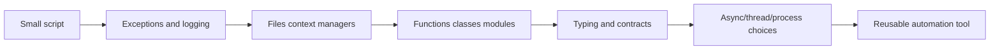
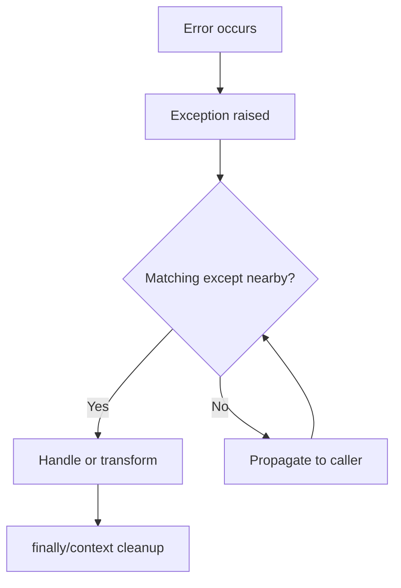
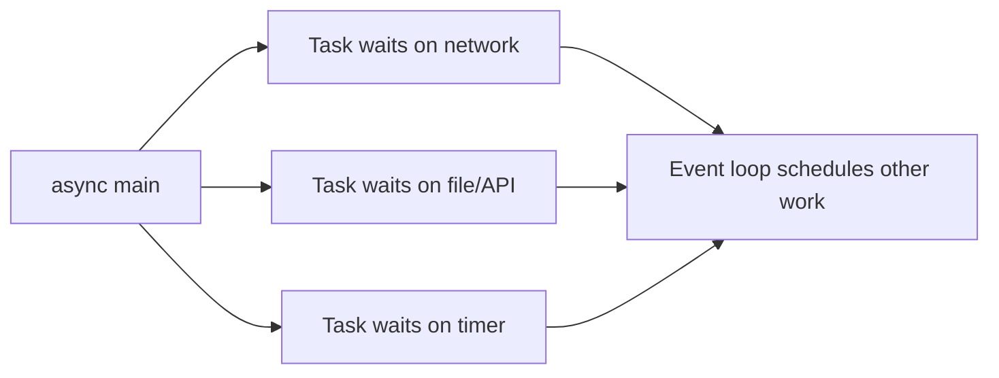

# 03 - Errors, Files, OOP, Typing, Async, and Automation

## Why This Chapter Matters

Python becomes a serious engineering language when you stop writing only isolated snippets and start writing programs that must fail clearly, manage resources, model behavior, communicate types, run I/O efficiently, and automate real systems.

This chapter connects the runtime foundation to production use:

```text
exceptions explain failure
context managers protect resources
classes model behavior and state
typing communicates contracts
async handles high-concurrency I/O
virtual environments isolate dependencies
standard library modules make automation practical
```

Cause -> Mechanism -> Immediate Result -> Long-Term Impact -> Next Connected Topic:

```text
scripts grow into tools
-> errors, files, OOP, typing, async, packages, and environments become necessary
-> Python remains productive while gaining structure
-> maintainable automation and services depend on explicit contracts and resource safety
-> testing, packaging, CI, DevOps automation, and production debugging
```

Official source baseline:

- Python errors and exceptions: <https://docs.python.org/3/tutorial/errors.html>
- Python classes: <https://docs.python.org/3/tutorial/classes.html>
- Python typing: <https://docs.python.org/3/library/typing.html>
- Python `asyncio`: <https://docs.python.org/3/library/asyncio.html>
- Python `venv`: <https://docs.python.org/3/library/venv.html>
- Python standard library: <https://docs.python.org/3/library/>

Version assumption: checked on 2026-05-27. Typing, async, GIL/free-threaded behavior, packaging tools, and standard-library details vary by Python version. Examples assume Python 3.11+ style unless noted, with CPython as the practical runtime baseline.

## The Big Picture

| Area | What it solves | Main trap |
| --- | --- | --- |
| Exceptions | Structured failure handling. | Catching too broadly and hiding real errors. |
| Files/context managers | Resource lifetime. | Relying on garbage collection for cleanup. |
| OOP | Group state with behavior. | Overengineering when functions/data are enough. |
| Typing | Communicate and check contracts. | Thinking hints enforce runtime behavior by default. |
| Async | High-concurrency I/O. | Blocking the event loop. |
| Virtual environments | Dependency isolation. | Confusing Python interpreter, venv, and package manager. |
| Standard library | Batteries for automation. | Rewriting existing tools badly. |



## First-Principles Explanation

### Why Exceptions Exist

Without exceptions, every operation would need manual error flags:

```text
open file -> did it work?
parse line -> did it work?
call API -> did it work?
write output -> did it work?
```

Exceptions let errors propagate until code that understands them can handle them.

Good pattern:

```text
fail near cause
catch near recovery
log with context
do not hide unknown failures
```

### Why Context Managers Exist

Files, locks, sockets, temporary directories, and transactions need cleanup.

Context managers encode:

```text
enter resource
-> do work
-> cleanup even if exception occurs
```

`with` is the visible syntax for that contract.

### Why OOP Exists in Python

Classes are useful when data and behavior belong together:

```text
connection config + connect/retry/close behavior
parsed command + validation + execution behavior
domain object + rules that operate on it
```

But Python does not require everything to be a class. Simple functions plus dictionaries/dataclasses are often better than deep inheritance.

### Why Typing Exists in a Dynamic Language

Type hints communicate intent to humans and tools.

They help:

- autocomplete
- static checks
- refactoring
- API design
- documentation
- testability

They do not automatically enforce runtime types unless you add runtime validation.

### Why Async Exists

Async is for many tasks waiting on I/O:

```text
network request
database query
websocket
subprocess wait
timer
```

It is not a magic CPU speedup. CPU-heavy work should usually use optimized libraries, multiprocessing, native extensions, or external workers.

## Core Vocabulary

| Term | Meaning | Why it matters |
| --- | --- | --- |
| Exception | Object representing an error condition. | Propagates failure with stack context. |
| Traceback | Stack of calls where an exception traveled. | Primary debugging evidence. |
| Context manager | Object supporting enter/exit protocol for `with`. | Ensures cleanup. |
| Class | Template for objects with attributes and methods. | Groups behavior and state. |
| Instance | Object created from a class. | Holds per-object state. |
| Dataclass | Class helper for data containers. | Reduces boilerplate. |
| Type hint | Annotation describing expected type. | Tooling and readability. |
| Coroutine | Async function result that can be awaited. | Unit of async work. |
| Event loop | Scheduler for async tasks and I/O callbacks. | Must not be blocked by synchronous work. |
| Virtual environment | Isolated Python environment for packages. | Prevents dependency conflicts. |
| Standard library | Modules shipped with Python. | Automation power without third-party installs. |

## Mental Model

Choose the right execution model:

```text
simple sequential work -> normal functions
many I/O waits -> asyncio or threads
CPU-bound Python work -> multiprocessing or optimized/native code
shared mutable state -> locks or redesign
external automation -> subprocess/pathlib/json/logging/argparse
```

Choose the right structure:

```text
one-off transformation -> function
data with few fields -> dataclass
state plus behavior -> class
plugin/callback -> function object or class protocol
large CLI/tool -> package with main entry point
```

## Architecture or Conceptual Structure

### Exception Flow



### Async Flow



Async gains throughput by not blocking the event loop while waiting.

## Step-by-Step Explanation

### Exceptions

```python
try:
    value = int(text)
except ValueError as exc:
    raise ValueError(f"invalid integer input: {text!r}") from exc
```

Why `from exc` matters:

```text
preserves causal chain
```

Avoid:

```python
try:
    ...
except Exception:
    pass
```

That hides failure.

Better:

```python
try:
    ...
except SpecificError as exc:
    logger.exception("failed to process record %s", record_id)
    raise
```

### Files and Paths

```python
from pathlib import Path

path = Path("data/input.txt")
text = path.read_text(encoding="utf-8")
```

For large files:

```python
with path.open("r", encoding="utf-8") as f:
    for line in f:
        process(line)
```

Why this matters:

- explicit encoding avoids platform surprises
- streaming avoids memory blowups
- `with` closes the file

### Logging

```python
import logging

logger = logging.getLogger(__name__)

def deploy(app: str) -> None:
    logger.info("deploying app=%s", app)
```

Use logging instead of `print` for real tools because logs can carry levels, modules, formatting, destinations, and timestamps.

### Classes and Dataclasses

Dataclass:

```python
from dataclasses import dataclass

@dataclass(frozen=True)
class DeployTarget:
    app: str
    environment: str
    namespace: str
```

Use when you need a clear data shape.

Class with behavior:

```python
class RetryPolicy:
    def __init__(self, attempts: int, delay_seconds: float) -> None:
        self.attempts = attempts
        self.delay_seconds = delay_seconds

    def should_retry(self, attempt: int) -> bool:
        return attempt < self.attempts
```

Avoid inheritance unless it represents a real substitutable relationship. Composition is often cleaner.

### Typing

```python
from collections.abc import Iterable

def total(values: Iterable[int]) -> int:
    return sum(values)
```

Typing principle:

```text
accept broad useful interfaces
return precise useful types
```

For structured dict-like data, consider:

```python
from typing import TypedDict

class UserRecord(TypedDict):
    id: int
    email: str
    active: bool
```

For runtime validation, use explicit checks or a validation library. Type hints alone do not enforce.

### Async

```python
import asyncio

async def fetch_user(user_id: int) -> dict:
    await asyncio.sleep(0.1)
    return {"id": user_id}

async def main() -> None:
    users = await asyncio.gather(
        fetch_user(1),
        fetch_user(2),
        fetch_user(3),
    )
    print(users)

asyncio.run(main())
```

Async rule:

```text
inside async code, avoid blocking calls
```

Bad:

```python
async def handler():
    time.sleep(5)  # blocks event loop
```

Better:

```python
async def handler():
    await asyncio.sleep(5)
```

### Virtual Environments

Create:

```bash
python -m venv .venv
```

Activate on Linux/macOS shell:

```bash
source .venv/bin/activate
```

Activate on Windows PowerShell:

```powershell
.venv\Scripts\Activate.ps1
```

Install:

```bash
python -m pip install requests
```

Why `python -m pip` matters:

```text
it uses pip attached to the Python interpreter you selected
```

### DevOps Automation Example

```python
import json
import subprocess
from pathlib import Path

def kubectl_get_pods(namespace: str) -> list[dict]:
    result = subprocess.run(
        ["kubectl", "get", "pods", "-n", namespace, "-o", "json"],
        check=True,
        text=True,
        capture_output=True,
    )
    payload = json.loads(result.stdout)
    return payload["items"]

def write_report(namespace: str, output: Path) -> None:
    pods = kubectl_get_pods(namespace)
    lines = [f"# Pod report for {namespace}", ""]
    for pod in pods:
        lines.append(f"- {pod['metadata']['name']}: {pod['status'].get('phase', 'Unknown')}")
    output.write_text("\n".join(lines) + "\n", encoding="utf-8")
```

Important details:

- use argument list, not shell string, to avoid shell quoting problems
- `check=True` fails on nonzero exit
- `capture_output=True` gives stdout/stderr for diagnostics
- parse JSON instead of scraping table output
- use `Path` for filesystem paths

## Internal Mechanics

### Exception Chaining

Python can show both original and transformed errors.

```python
try:
    int(value)
except ValueError as exc:
    raise ConfigError("bad port") from exc
```

This preserves the real cause while raising a domain-specific error.

### Context Manager Protocol

`with obj:` calls:

```text
obj.__enter__()
try body
obj.__exit__(exc_type, exc, traceback)
```

This is why cleanup runs even during exceptions.

### Async Coroutines Are Not Running Until Scheduled/Awaited

```python
coro = fetch_user(1)
```

This creates a coroutine object. It does not finish the work until awaited or scheduled.

### Type Hints Are Metadata

Python stores annotations, but normal function calls do not check them.

```python
def add(a: int, b: int) -> int:
    return a + b

add("x", "y")  # returns "xy" at runtime unless checked elsewhere
```

Static tools can flag this before runtime.

## Practical Examples

### Robust Config Loader

```python
import json
from pathlib import Path

class ConfigError(Exception):
    pass

def load_config(path: Path) -> dict:
    try:
        text = path.read_text(encoding="utf-8")
        data = json.loads(text)
    except FileNotFoundError as exc:
        raise ConfigError(f"config file not found: {path}") from exc
    except json.JSONDecodeError as exc:
        raise ConfigError(f"config file is not valid JSON: {path}") from exc

    if not isinstance(data, dict):
        raise ConfigError("config root must be an object")
    return data
```

Why this is good:

- specific exceptions
- causal chaining
- explicit encoding
- validation after parse

### CLI Skeleton

```python
import argparse
from pathlib import Path

def build_parser() -> argparse.ArgumentParser:
    parser = argparse.ArgumentParser()
    parser.add_argument("--config", type=Path, required=True)
    parser.add_argument("--dry-run", action="store_true")
    return parser

def main() -> int:
    args = build_parser().parse_args()
    print(args.config, args.dry_run)
    return 0

if __name__ == "__main__":
    raise SystemExit(main())
```

Why `raise SystemExit(main())` matters:

```text
the return code becomes process exit status
```

## Small Details That Matter Later

- Catch specific exceptions before broad exceptions.
- Use `raise ... from exc` when translating exceptions.
- Do not swallow exceptions silently in automation.
- Use `with` for files, locks, temporary directories, and network resources that support context managers.
- Always think about text encoding.
- Type hints help tools; they do not enforce by default.
- Use `collections.abc` interfaces such as `Iterable` and `Mapping` for flexible input types.
- Async code must not call blocking functions casually.
- CPU-bound Python usually needs multiprocessing, native libraries, or another architecture, not just `async`.
- `python -m pip` avoids many interpreter/pip mismatch bugs.
- Virtual environments isolate Python packages, not system packages or external binaries.
- Use `subprocess.run([...], check=True, capture_output=True, text=True)` for safe command execution patterns.
- Prefer structured output such as JSON over parsing human tables.
- Logging should include context, but not secrets.

## Common Misunderstandings

### Misunderstanding 1: "Type hints enforce types."

They communicate and help tools. Runtime enforcement requires explicit validation or a library.

### Misunderstanding 2: "Async makes code parallel."

Async coordinates waiting. It does not make CPU-heavy Python code run on multiple cores by itself.

### Misunderstanding 3: "A class is always more professional."

Functions and dataclasses are often cleaner. Use classes when state and behavior belong together.

### Misunderstanding 4: "Virtual environments make everything reproducible."

They isolate installed packages, but reproducibility also needs pinned dependencies, Python version control, OS/library assumptions, and lock files where appropriate.

## Failure Modes / Mistakes / Traps

### Trap 1: Bare `except`

```python
try:
    deploy()
except:
    pass
```

This hides operational failure.

### Trap 2: Blocking Async Event Loop

```python
async def main():
    requests.get(url)  # blocking library call
```

Use an async HTTP client or run blocking work in an executor deliberately.

### Trap 3: Shell Injection or Quoting Bugs

```python
subprocess.run(f"kubectl get pod {name}", shell=True)
```

Prefer argument lists:

```python
subprocess.run(["kubectl", "get", "pod", name], check=True)
```

### Trap 4: Printing Secrets

Logs and exception messages can leak tokens, credentials, and config values.

## Debugging / Analysis / Answer-Writing Method

For automation failures:

1. Read the traceback top and bottom.
2. Identify the original exception cause.
3. Check external command exit code, stdout, stderr.
4. Validate file path and encoding.
5. Validate environment and active Python interpreter.
6. Check installed package versions.
7. Separate parse errors from validation errors.
8. Separate async scheduling errors from blocking I/O.

Useful commands:

```bash
python --version
python -m pip --version
python -m pip list
python -m venv .venv
python -m json.tool config.json
```

## Real-World or Exam Relevance

Interviewers and production reviews often test:

- exception specificity
- context-manager use
- OOP vs functional choices
- type hints and static checking
- async vs threads vs processes
- packaging and virtual environments
- safe subprocess usage
- log quality

Strong answer pattern:

```text
Python programs should fail loudly with specific exceptions, clean resources with context managers, use classes when behavior and state belong together, use type hints as contracts for humans and tools, use async for high-concurrency I/O rather than CPU parallelism, and isolate dependencies with virtual environments.
```

## Connected Topics

- [Runtime Foundations Objects and References](01%20-%20Runtime%20Foundations%20Objects%20and%20References.md)
- [Core Types Functions Iterators and Modules](02%20-%20Core%20Types%20Functions%20Iterators%20and%20Modules.md)
- DevOps automation with Ansible, Kubernetes, Docker, and AWS CLIs.
- Java exception handling and type system.
- C++ RAII and resource lifetime.

## Chapter Summary

Python scales from script to tool when the program gains discipline:

```text
clear errors
safe resource management
explicit structure
useful type contracts
right concurrency model
isolated dependencies
standard-library leverage
```

The important tradeoff is that Python gives you speed of expression. You must add engineering boundaries as the program becomes important.

## Questions to Test Understanding

1. Why should you catch specific exceptions?
2. What does a context manager guarantee?
3. When should you use a class?
4. Do type hints enforce types at runtime?
5. What kind of workload fits `asyncio` best?
6. Why is `time.sleep` bad inside async code?
7. Why use `python -m pip`?
8. Why prefer `subprocess.run` with an argument list?
9. Why parse JSON output instead of table output in automation?
10. What does `raise ... from exc` preserve?

## Answers and Reasoning

1. Specific catches handle known recovery paths without hiding unrelated bugs.
2. It runs cleanup logic through `__exit__` even if an exception occurs.
3. Use a class when state and behavior belong together or a clear object abstraction improves design.
4. No. They are metadata for tools and readers unless runtime validation is added.
5. Many concurrent I/O waits such as network requests, sockets, database calls, and timers.
6. It blocks the event loop and prevents other async tasks from running.
7. It ensures pip belongs to the selected Python interpreter or virtual environment.
8. It avoids shell quoting and injection issues and makes arguments explicit.
9. JSON is structured and stable for machines; table output is for humans and may change formatting.
10. It preserves the original exception as the cause while raising a higher-level exception.

