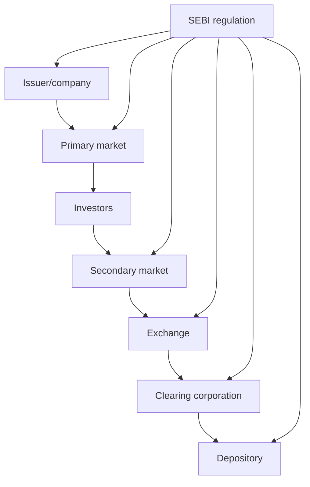

# 02 - Securities Markets, Regulation, Finance, and Descriptive Core

## Why This Chapter Matters

SEBI Grade A questions become easy when securities-market concepts are tied to real market problems: information asymmetry, mis-selling, insider trading, price manipulation, settlement risk, weak disclosure, intermediary conflict, and investor grievance. This chapter gives the core regulatory mental model.

## The Big Picture

```text
issuer raises capital
  -> intermediaries enable access
  -> investors evaluate risk
  -> exchanges provide trading
  -> clearing/settlement completes trades
  -> SEBI regulates conduct and disclosure
```

## First-Principles Explanation

Cause: Markets can fail when information is hidden, insiders exploit advantages, intermediaries mis-sell, trades do not settle, or manipulation distorts prices.

Mechanism: Regulation imposes disclosure, licensing, conduct rules, surveillance, enforcement, investor education, grievance redressal, and market infrastructure standards.

Immediate result: Investors receive better information and markets operate with more trust.

Long-term impact: Fairer markets support capital formation, but regulation must avoid unnecessary friction.

## Core Vocabulary

| Term | Meaning | Exam relevance |
| --- | --- | --- |
| Primary market | New issue of securities. | IPOs, disclosures, capital raising. |
| Secondary market | Trading of existing securities. | Liquidity and price discovery. |
| Stock exchange | Platform for trading securities. | Market infrastructure. |
| Depository | Holds securities in dematerialized form. | Settlement and ownership records. |
| Clearing corporation | Manages clearing/settlement obligations. | Reduces settlement risk. |
| Mutual fund | Pooled investment vehicle. | Retail investor protection and disclosure. |
| Derivative | Contract deriving value from underlying. | Hedging, speculation, margin, systemic risk. |
| Insider trading | Trading on unpublished price-sensitive information. | Market fairness and enforcement. |
| Disclosure | Required market information. | Reduces information asymmetry. |

## Regulatory Causal Chains

### Disclosure

Information asymmetry -> investors cannot price risk -> mandatory disclosure -> better informed investment decisions -> lower fraud risk and stronger capital formation.

### Insider Trading

Unpublished price-sensitive information -> unfair trading advantage -> prohibition/surveillance/disclosure controls -> market fairness -> investor confidence.

### Intermediary Regulation

Investors depend on brokers/advisers/merchant bankers -> conflict and mis-selling risk -> registration, conduct rules, inspections, enforcement -> safer market access.

### Mutual Fund Regulation

Retail investors pool money -> agency risk and product complexity -> disclosure, investment norms, valuation, expense controls, trustee/AMC governance -> investor protection.

## Architecture or Conceptual Structure



## Finance and Economics Core

High-yield areas:

- time value of money
- bonds and yields
- equity and valuation basics
- risk and return
- derivatives and margin
- mutual funds and NAV
- primary vs secondary market
- monetary/fiscal policy basics
- inflation, growth, financial stability
- accounting statements and ratios

## Descriptive Answer Method

For regulatory answers:

```text
market problem
  -> legal/regulatory mechanism
  -> effect on investors
  -> effect on issuers/intermediaries
  -> limitations
  -> recent/current example
  -> conclusion
```

## Small Details That Matter Later

- Primary market raises capital; secondary market gives liquidity.
- Disclosure does not remove risk; it makes risk more visible.
- Derivatives can hedge risk or amplify speculation.
- Settlement risk is a market-infrastructure problem.
- Investor protection is not anti-market; it supports market confidence.
- Enforcement credibility affects deterrence.
- Accounting ratios must be interpreted, not memorized.
- Current SEBI circulars and consultation papers can become descriptive examples.

## Common Misunderstandings

| Misunderstanding | Correction |
| --- | --- |
| IPO regulation is only form-filling. | It reduces information asymmetry in capital raising. |
| Secondary markets do not affect companies. | Liquidity and price discovery affect cost of capital. |
| Derivatives are only gambling. | They also provide hedging and price discovery, with risk controls. |
| Investor protection means banning risk. | It means fair disclosure, conduct, and grievance systems. |

## Practice Questions

1. Explain why disclosure is central to securities regulation.
2. How does intermediary regulation protect retail investors?
3. Discuss the role of clearing corporations in market stability.
4. Why are derivatives regulated?
5. Explain how mutual fund regulation balances investor protection and market development.

## Answer Hints

1. Link asymmetry, pricing, trust, fraud reduction, capital formation.
2. Include registration, conduct, suitability, grievance, inspections, enforcement.
3. Include counterparty risk, settlement guarantee, margins, clearing, systemic stability.
4. Include hedging, speculation, leverage, margin, systemic risk, transparency.
5. Include pooling, disclosure, expenses, valuation, governance, risk.
