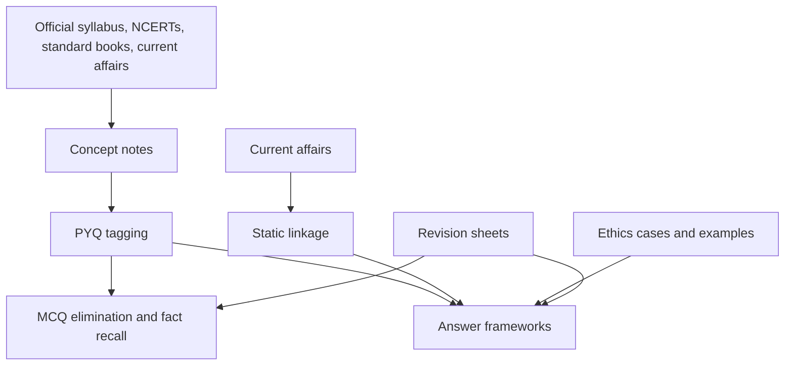

# UPSC CSE 2026 Source Refresh and Answer-Writing Playbook

## Why This Chapter Matters

The UPSC notes in this vault already contain a strong NCERT-backed foundation, official syllabus mapping, General Studies expansion files, revision files, and current-affairs workflow. This file is not a duplicate syllabus note. It is a source-refresh and method note for using the existing material against the current Civil Services Examination pattern.

UPSC preparation fails when students collect facts without learning how the exam uses them. The Preliminary exam tests selection under uncertainty. The Main exam tests depth, structure, judgment, and concise expression. The Personality Test examines suitability, awareness, balance, and administrative temperament. The same topic must therefore be studied in three forms: fact, analysis, and judgement.

Source snapshot: 2026-05-27. Current exam facts below are based on the UPSC Civil Services Examination 2026 notification PDF accessed through the official UPSC notification archives. Dates, vacancies, application procedures, and rules must be rechecked from the latest official UPSC notice for the exact exam year.

Official sources:

- UPSC notification archives: <https://upsc.gov.in/exams-related-info/exam-notification/archives>
- Civil Services Examination 2026 notification PDF: <https://upsc.gov.in/sites/default/files/Notif-CSP-2026-Engl-060226Rev.pdf>

## The Big Picture

The Civil Services Examination is not one exam. It is a filtration system:

```text
Prelims
  -> broad elimination under negative marking
  -> Mains
  -> analytical written evaluation
  -> Personality Test
  -> administrative suitability and judgement
  -> final merit
```

The 2026 official notice lists two successive stages: Civil Services Preliminary Examination for selection to Main Examination, and Civil Services Main Examination with Written and Interview/Personality Test for selection to services and posts.

## First-Principles Explanation

Cause: Civil service roles require breadth, judgment, written clarity, constitutional values, administrative awareness, and decision-making under uncertainty.

Mechanism: UPSC uses Prelims to screen, Mains to assess understanding and expression, and Personality Test to evaluate suitability beyond written marks.

Immediate result: Preparation must combine static syllabus, current affairs, answer writing, elimination practice, ethics case practice, and revision.

Long-term impact: A candidate who studies only facts may clear some MCQs but struggle in Mains. A candidate who writes broad opinions without factual grounding may fail to convince the examiner. Mastery comes from linking facts to causes, consequences, institutions, data, examples, and balanced conclusions.

Next connected topic: syllabus-to-source mapping, PYQ tagging, essay frameworks, ethics case studies, and current-affairs integration.

## Core Vocabulary

| Term | Meaning | Why it matters |
| --- | --- | --- |
| Prelims GS Paper I | Objective screening paper whose marks decide qualification for Mains with CSAT qualification. | Requires breadth, elimination, and risk control. |
| CSAT / GS Paper II | Qualifying Prelims paper with minimum qualifying threshold specified by UPSC. | Neglect can disqualify otherwise strong candidates. |
| Mains | Written descriptive exam with qualifying language papers and merit-counting papers. | Requires answer structure and depth. |
| Essay | Merit paper testing structured thought, expression, examples, and balance. | Cannot be prepared by facts alone. |
| GS I-IV | Four General Studies papers covering history, geography, society, polity, governance, IR, economy, science, environment, security, disaster management, and ethics. | Backbone of Mains preparation. |
| Optional | Candidate-selected subject with two papers. | Major score lever requiring separate depth. |
| Personality Test | Interview stage carrying marks in final ranking. | Tests judgement, awareness, composure, and suitability. |
| PYQ | Previous Year Question. | Shows how UPSC asks, not just what UPSC lists. |

## Current Official Pattern Snapshot

For CSE 2026, the official notification records:

- Notification date: 04 February 2026.
- Preliminary Examination date listed in archive: 24 May 2026.
- Approximate vacancies: 933, subject to change after firm numbers from cadre controlling authorities.
- Preliminary Examination: two compulsory objective papers of 200 marks each.
- CSAT / GS Paper II: qualifying paper with minimum qualifying marks of 33%.
- Negative marking: one-third of the marks assigned to a question for a wrong answer.
- Mains written exam: 9 conventional essay-type papers, of which two language papers are qualifying.
- Merit-counting written papers: Essay, GS I, GS II, GS III, GS IV, Optional Paper I, Optional Paper II.
- Interview/Personality Test: 275 marks.
- Written merit subtotal: 1750 marks; grand total with Personality Test: 2025 marks.

Verification rule:

Do not memorize this as timeless. UPSC rules, application process, dates, vacancies, document requirements, and instructions must be checked against the official notice for the specific exam year.

## Mental Model

UPSC preparation is a three-layer conversion:

```text
source reading
  -> notes and concept clarity
  -> question-oriented retrieval
  -> answer/MCQ performance
```

If a topic cannot be used in an answer, map, diagram, MCQ elimination, ethics example, or current-affairs link, it is not yet exam-ready.

## Causal Chain Requirement for UPSC Notes

For history, polity, governance, economy, environment, and society, every major topic should be converted into:

```text
event/problem
  -> causes
  -> institutions/laws/policies involved
  -> immediate impact
  -> long-term consequence
  -> present relevance
  -> possible Prelims and Mains question angle
```

## Architecture or Conceptual Structure



## Step-by-Step Use of This Vault

### 1. Start With the Official Syllabus Layer

Use:

- [Official Syllabus Index](Official_Syllabus/00_UPSC_CSE_Syllabus_Index.md)
- [Whole Syllabus Revision Map](Official_Syllabus/10_Whole_Syllabus_Revision_Map.md)
- [Official Syllabus Coverage Audit](Official_Syllabus/12_Official_Syllabus_Coverage_Audit.md)

Purpose:

This prevents preparation from becoming random reading.

### 2. Build Static Foundation From Subject Indexes

Use:

- Polity index
- History index
- Geography index
- Economy index
- Environment index
- General Studies index

Purpose:

These notes explain core concepts and NCERT foundations.

### 3. Convert Every Topic Into Exam Output

For each chapter, prepare:

- 5 Prelims facts/traps
- 2 Mains questions
- 1 diagram/map/table
- 1 current-affairs linkage
- 1 administrative example
- 1 short conclusion line

### 4. Use PYQs as Boundary Markers

PYQs show:

- wording style
- depth expected
- recurring themes
- traps
- static-current integration
- answer dimensions

They do not guarantee repetition, but they reveal exam logic.

## Internal Mechanics of Answer Writing

### The 7-Part Mains Answer Frame

```text
Direct opening
  -> brief context
  -> 3-5 analytical dimensions
  -> data/committee/article/example
  -> diagram/table if useful
  -> balanced challenges
  -> way forward/conclusion
```

### The Prelims Elimination Method

1. Identify extreme words: only, always, never, all, entirely.
2. Check chronology.
3. Check institution vs act vs scheme confusion.
4. Check central vs state responsibility.
5. Check constitutional article/body wording.
6. Check whether the option is factually true but irrelevant.
7. Mark only when confidence justifies negative marking risk.

### Ethics Case Study Method

```text
stakeholders
  -> ethical issues
  -> legal/administrative constraints
  -> options
  -> consequence analysis
  -> decision
  -> safeguards
```

Ethics answers should not sound like sermons. They must show administrative judgement.

## Small Details That Matter Later

- CSAT is qualifying, but failing it eliminates the candidate.
- Prelims marks are screening marks and are not counted for final merit.
- Mains qualifying language papers matter because failure can block evaluation of merit papers as per official rules.
- Negative marking makes blind guessing dangerous.
- The Mains notification language emphasizes depth of understanding, not merely range of information.
- "Discuss" needs multiple sides; "critically examine" needs evaluation; "analyse" needs cause-mechanism-impact.
- Facts without linkage do not create strong Mains answers.
- Current affairs without static grounding becomes newspaper narration.
- Ethics answers need examples and practical decisions, not only definitions.
- Diagrams must clarify, not decorate.
- For economy answers, always include problem, policy mechanism, stakeholders, impact, limitations, and way forward.
- For environment answers, include ecological mechanism, governance/legal angle, and current example.

## Common Misunderstandings

| Misunderstanding | Correction |
| --- | --- |
| More sources automatically mean better preparation. | Fewer sources revised deeply usually beat scattered reading. |
| Prelims and Mains require completely separate preparation. | They share the same conceptual base but require different outputs. |
| Current affairs are only monthly compilations. | They must be linked to static syllabus themes. |
| Mains answers need literary language. | They need clarity, structure, relevance, and balanced analysis. |
| Ethics is common sense only. | It needs concepts, stakeholder analysis, and administrative reasoning. |

## Failure Modes / Mistakes / Traps

| Failure mode | Cause | Fix |
| --- | --- | --- |
| Reads but cannot answer | Passive notes, no output practice | Convert every topic into questions and answer skeletons. |
| Prelims score unstable | Poor elimination and revision | Use fact sheets, PYQ tagging, and mock error logs. |
| Mains answers generic | No data/examples/frameworks | Add constitutional, committee, scheme, case, or current anchor. |
| Essay becomes GS answer | Topic not explored philosophically/socially | Use multi-dimensional essay frameworks. |
| Ethics answers sound moralistic | No stakeholder/options analysis | Use case method and practical safeguards. |
| Current affairs overload | No syllabus mapping | Tag every issue to GS paper and topic. |

## Debugging / Analysis / Answer-Writing Method

When a mock or PYQ goes wrong:

1. Was the concept unknown?
2. Was the concept known but not recalled?
3. Was the wording misread?
4. Was a trap missed?
5. Was the answer too generic?
6. Was evidence/example missing?
7. Was time management poor?

Maintain an error log with one correction rule per mistake.

## Real-World or Exam Relevance

This file should be read before every major revision cycle. It tells you how to use the existing vault:

- NCERT files for conceptual foundations
- syllabus files for boundaries
- GS expansion files for Mains depth
- revision files for final consolidation
- current-affairs files for dynamic linkage
- practice workflow for output conversion

## Connected Topics

- [00_Master_Index](00_Master_Index.md)
- [00_Source_Manifest](00_Source_Manifest.md)
- [00_Quality_Audit](00_Quality_Audit.md)
- [Official Syllabus Coverage Audit](Official_Syllabus/12_Official_Syllabus_Coverage_Audit.md)
- [PYQ Tagging And Solved Practice Workflow](General_Studies/Practice/01_PYQ_Tagging_And_Solved_Practice_Workflow.md)
- [Current Affairs And Prelims Revision Workflow](General_Studies/Prelims/02_Current_Affairs_And_Prelims_Revision_Workflow.md)

## Chapter Summary

UPSC preparation must convert source reading into exam performance. The official exam structure rewards breadth in Prelims, depth and expression in Mains, and administrative suitability in the Personality Test. The vault already contains the raw subject foundation; this playbook explains how to use it through causal chains, PYQ mapping, answer frameworks, revision, and current-affairs linkage.

## Questions to Test Understanding

1. Why is CSAT dangerous even though it is qualifying?
2. Why should every current-affairs issue be mapped to a static syllabus topic?
3. What is the difference between a Prelims fact and a Mains point?
4. Why does an ethics case study need stakeholder analysis?
5. Why are PYQs more useful than a raw topic list?

## Answers and Reasoning

1. Failure in CSAT eliminates the candidate regardless of GS Paper I performance.
2. Static mapping converts news into answer-ready analysis instead of isolated information.
3. A Prelims fact helps eliminate/select options; a Mains point explains cause, mechanism, impact, and judgement.
4. Administration affects multiple actors. Stakeholder analysis prevents one-sided moral answers.
5. PYQs reveal exam wording, depth, recurring themes, and traps.
