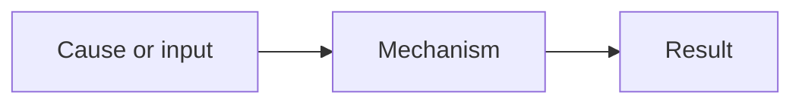

# <% tp.file.title %>

## Why This Chapter Matters

## The Big Picture

## First-Principles Explanation

## Core Vocabulary

## Mental Model

## Historical / Evolution / Causal Chain

Cause → Mechanism → Immediate Result → Long-Term Impact → Next Connected Topic

## Architecture or Conceptual Structure

## Step-by-Step Explanation

## Internal Mechanics

## Practical Examples

## Small Details That Matter Later

## Common Misunderstandings

## Failure Modes / Mistakes / Traps

## Debugging / Analysis / Answer-Writing Method

## Real-World or Exam Relevance

## Connected Topics

## Chapter Summary

## Questions to Test Understanding

## Answers and Reasoning
