## Why This Chapter Matters

Nearly every non-trivial application must remember something: a customer's order, an account balance, a product catalogue, a session, or the result of an expensive calculation. The difficult question is not merely, “Where can I put data?” It is:

> What data model, durability, latency, availability, and operational responsibility does this workload require?

Amazon RDS, Amazon Aurora, and Amazon ElastiCache answer different parts of that question:

- **Amazon RDS** runs familiar relational database engines while AWS manages much of the infrastructure and routine operations.
- **Amazon Aurora** is AWS's distributed, cloud-designed relational engine, compatible with MySQL or PostgreSQL at the protocol and SQL level to a substantial—but not perfect—degree.
- **Amazon ElastiCache** keeps frequently needed or short-lived data in memory so applications can respond faster and avoid repeatedly burdening the durable database.

These are complementary services, not three interchangeable databases. A common production design uses Aurora or RDS as the **system of record** and ElastiCache as a **speed layer** in front of it.

```text
Cause: durable relational data is required
  → Mechanism: use RDS or Aurora as the system of record
  → Immediate result: transactions and persistent records survive process failure
  → New pressure: repeated reads and connection bursts overload the database
  → Next mechanism: add ElastiCache and/or RDS Proxy at the appropriate seam
```

## The Big Picture

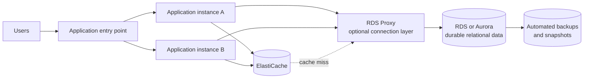

The data responsibilities are deliberately different:

| Layer | Primary purpose | Can it normally be the source of truth? | Typical lifetime |
| --- | --- | --- | --- |
| RDS/Aurora | Durable relational records and transactions | Yes | Long-lived |
| ElastiCache | Low-latency copies, counters, queues, or sessions | Usually no | Seconds to days, often controlled by TTL |
| RDS Proxy | Reuse and manage database connections | No; it stores no business record | Connection lifetime |
| Snapshot/backup | Recovery copy | Recovery source, not the active serving database | Retention-policy dependent |

## First-Principles Explanation

### What makes a database relational?

A relational database organizes data into tables with defined columns and relationships. For example:

```text
customers(customer_id, name)
orders(order_id, customer_id, total, status)
```

`orders.customer_id` can reference `customers.customer_id`. The engine can enforce constraints and execute a transaction such as “create order, reserve inventory, record payment” as one logical unit.

Relational engines are chosen when the workload benefits from:

- Structured schemas and relationships.
- SQL queries and joins.
- Constraints such as primary keys, foreign keys, and uniqueness.
- Transactions with ACID properties.
- Mature tooling and compatibility with an existing application.

### What does ACID mean here?

| Property | Plain-language meaning | Why it matters |
| --- | --- | --- |
| Atomicity | A transaction completes as a unit or is rolled back as a unit. | An order should not be charged without being created. |
| Consistency | A committed transaction preserves declared rules and constraints. | A foreign key should not point to a customer that does not exist. |
| Isolation | Concurrent transactions do not produce forbidden interference. | Two buyers should not both acquire the final item because of an uncontrolled race. |
| Durability | Once committed, data survives expected failures according to the system's guarantees. | A confirmed payment must not vanish after a process restarts. |

ACID does **not** mean every architecture is automatically correct. Schema design, transaction boundaries, isolation level, retry logic, and application bugs still matter.

### Why not install a database directly on EC2?

You can run MySQL, PostgreSQL, Oracle, SQL Server, or another database on EC2. That grants maximum operating-system and database control, but it also makes your team responsible for the operational machinery:

- Provisioning and hardening the host.
- Installing and patching the OS and database.
- Designing backups and testing restores.
- Configuring replication and failover.
- Replacing failed infrastructure.
- Monitoring disk space, memory, connections, and replication.
- Protecting credentials, keys, and network paths.

RDS exists because many teams want the database engine without owning all of that undifferentiated infrastructure work.

```text
Self-managed DB on EC2
  = maximum control + maximum operational responsibility

RDS
  = constrained host access + AWS-managed infrastructure operations

RDS Custom
  = a controlled middle ground for supported Oracle/SQL Server use cases
```

### Why does a cache exist if the database already stores the data?

Durable databases optimize for correctness, recovery, flexible querying, and persistent storage. Memory is much faster than durable storage, and a key lookup is simpler than repeatedly executing a join or aggregation.

Suppose a product page receives 50,000 requests per minute, while the product description changes twice a day. Running the same relational query 50,000 times wastes database CPU and I/O. Caching the result for a short period converts repeated database work into fast memory lookups.

The tradeoff is a second representation of the data. Once two representations exist, the application must decide when the cached one becomes stale and how it is refreshed or invalidated.

## Core Vocabulary

| Term | Meaning |
| --- | --- |
| DB instance | Compute and memory running a database engine in RDS. |
| DB cluster | A group of database compute instances and/or shared cluster storage, depending on the RDS/Aurora deployment model. |
| Primary/writer | The instance accepting writes. Modern AWS documentation generally uses **writer** rather than “master.” |
| Standby | A high-availability copy intended for failover, not necessarily available for application reads. |
| Read replica | A readable copy used mainly to scale reads; asynchronous replication means lag is possible. |
| Endpoint | A DNS name through which an application reaches a database or cache role. Do not hard-code an underlying IP address. |
| Failover | Moving the active database role to healthy infrastructure after failure or during an operation. |
| RPO | Recovery point objective: how much recent data loss the business can tolerate. |
| RTO | Recovery time objective: how long service restoration may take. |
| PITR | Point-in-time recovery: restoring to a selected time inside the available backup window. |
| Cache hit | Requested data was found in the cache. |
| Cache miss | Requested data was absent or expired, so the application must obtain it elsewhere. |
| TTL | Time to live: how long a cached key remains valid before expiration. |
| Eviction | Removal of cached data, commonly because memory is full or a policy chooses a key to discard. |
| Replica lag | Delay between a write on the source and visibility of that write on an asynchronous replica. |

## Mental Model

Use four independent design axes. AWS questions often hide the answer by mixing them together.

1. **Persistence:** Must this copy survive cache/node loss?
2. **Availability:** Must the service automatically recover from an instance or AZ failure?
3. **Scale:** Is pressure dominated by reads, writes, connections, storage, or unpredictable capacity?
4. **Freshness:** Can a reader tolerate data that is seconds or minutes old?

Then map each requirement to the correct mechanism:

| Requirement | Primary mechanism |
| --- | --- |
| Relational system of record | RDS or Aurora |
| Instance/AZ high availability | RDS Multi-AZ or a multi-instance Aurora cluster |
| More read throughput | RDS read replicas or Aurora Replicas/reader endpoint |
| Too many short-lived DB connections | RDS Proxy and application-aware connection management |
| Repeated hot reads need sub-millisecond/millisecond access | ElastiCache |
| Cross-Region local reads and relational DR | Cross-Region replica where supported, or Aurora Global Database |
| Recovery from accidental deletion | PITR, snapshot restore, or Aurora Backtrack where supported |

> [!important] The most tested distinction
> **Multi-AZ answers availability. Read replicas answer read scaling.** A design may need both.

## Historical / Evolution / Causal Chain

```text
Database installed on one server
  → simple, but server/storage failure causes an outage
  → replication and backups are added manually
  → operations become specialized and error-prone
  → RDS automates common infrastructure and database lifecycle work
  → Multi-AZ and read replicas solve different availability/scale pressures
  → Aurora moves replication into distributed storage and separates compute from storage
  → high traffic still creates repeated-query and connection pressure
  → ElastiCache reduces repeated reads; RDS Proxy absorbs connection churn
```

The evolution does not make older choices obsolete. A standard RDS engine may be preferable for exact engine compatibility, licensing requirements, extensions, operational familiarity, or lower cost. Aurora is selected when its architecture and supported feature set match the workload—not merely because it is newer.

---

# Part I — Amazon RDS

## What Amazon RDS Is

Amazon Relational Database Service is a managed service for deploying and operating relational database engines. As of the source-review date, the RDS family includes:

- PostgreSQL.
- MySQL.
- MariaDB.
- Oracle Database.
- Microsoft SQL Server.
- IBM Db2.
- Amazon Aurora, with MySQL-compatible and PostgreSQL-compatible editions.

Availability varies by Region, engine version, edition, license model, and instance class.

### The shared-responsibility boundary

AWS commonly manages:

- Infrastructure provisioning and hardware replacement.
- Host operating-system maintenance for standard RDS.
- Database software patching within the controls the service exposes.
- Automated backup machinery.
- Monitoring integrations and service events.
- Multi-AZ replication and failover when configured.
- Storage expansion when you request it or configure supported autoscaling.

You still manage:

- Data classification and architecture.
- Schema, tables, indexes, and query plans.
- Database users and least-privilege grants.
- Engine parameters exposed through parameter groups.
- Backup retention, deletion protection, and restore testing.
- Network placement and security-group rules.
- Encryption choices and KMS-key permissions.
- Application connection pools, timeouts, retries, and idempotency.
- Capacity selection, performance monitoring, and cost.

“Managed” means the responsibility boundary moved; it does not mean database administration disappeared.

## RDS Architecture and Connection Flow

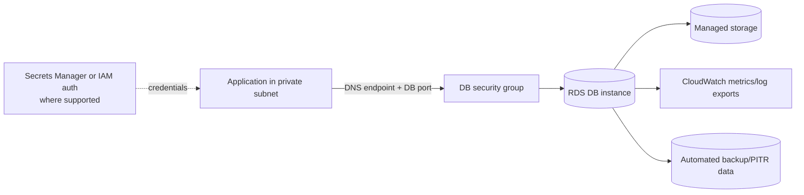

A production database should normally be placed in private subnets. A DB subnet group tells RDS which subnets it may use. The database security group should allow inbound traffic from the **application's security group** on the engine port, rather than from the entire internet.

Connection diagnosis therefore follows a chain:

```text
Client DNS resolution
  → route and subnet reachability
  → security group/NACL path
  → TLS negotiation
  → database authentication
  → database authorization
  → query execution
```

## Choosing an RDS Engine

Choose by compatibility and workload requirements before comparing instance sizes.

| Situation | Likely direction | Check carefully |
| --- | --- | --- |
| Existing PostgreSQL application | RDS for PostgreSQL or Aurora PostgreSQL-Compatible | Extensions, version support, Aurora compatibility differences |
| Existing MySQL application | RDS for MySQL or Aurora MySQL-Compatible | Engine behavior, plugins, binlog needs, cost |
| Commercial engine dependency | RDS for Oracle, SQL Server, or Db2 | Edition, licensing, feature, Region, and instance-class support |
| Need host/OS customization for a supported commercial engine | RDS Custom | Support perimeter and operational burden |
| Need arbitrary OS control or unsupported software | Self-managed database on EC2 | You own HA, patching, backups, and recovery |

## RDS Storage and Storage Autoscaling

RDS DB instances use managed storage whose supported type and limits depend on the engine and deployment. Storage and compute are related capacity decisions:

- **Storage capacity** determines how many GiB/TiB are allocated.
- **IOPS and throughput** determine how quickly storage can serve work.
- **Instance class** determines CPU, memory, network, and connection capability.

Increasing capacity does not repair a missing index, a lock storm, or a query that scans an entire table unnecessarily.

### Storage autoscaling

Storage autoscaling increases allocated storage when free space becomes dangerously low. You set a **maximum storage threshold**, which is a guardrail—not a target that RDS immediately allocates.

Under the current documented algorithm, RDS starts an autoscaling modification when:

- Free available space is less than or equal to 10% of allocated storage.
- That low-storage condition lasts at least five minutes.
- Storage optimization from the previous modification has completed and fewer than four storage modifications occurred in the preceding 24 hours.

The increase is the greatest of 10 GiB, 10% of current allocation, or predicted growth needed for the next seven hours. Details and support restrictions can change.

```text
Unpredictable growth
  → free storage crosses the threshold
  → RDS expands storage up to the configured maximum
  → immediate disk-full risk falls
  → team still investigates retention, logs, table growth, and cost
```

> [!warning] Autoscaling is not capacity governance
> If the maximum threshold is too low, the database can still run out of space. If it is too high and growth is caused by a bug, autoscaling can turn a defect into a larger bill. Storage does not automatically shrink afterward.

## High Availability: RDS Multi-AZ

### Classic Multi-AZ DB instance deployment

In the classic model, RDS maintains a primary DB instance in one AZ and a synchronous standby in another AZ.

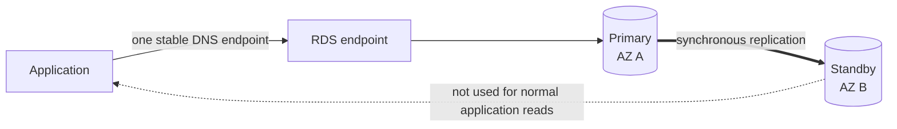

If RDS detects a qualifying infrastructure, storage, network, or AZ problem, it can fail over to the standby. The endpoint remains the application's logical connection name, but its DNS target changes. Existing connections can break; clients must reconnect and retry safely.

Multi-AZ provides:

- Higher availability.
- Automatic failover managed by RDS.
- Protection against specified instance/storage/AZ failure scenarios.
- Maintenance resilience compared with a single instance.

Multi-AZ does **not** provide:

- Read scaling from the classic standby.
- Cross-Region disaster recovery by itself.
- Protection from an application issuing a valid but destructive SQL statement.
- A guarantee that users observe zero errors during failover.

### Multi-AZ DB clusters: the naming trap

RDS also offers **Multi-AZ DB clusters** for supported engines/configurations. These have a writer and readable standby instances across three AZs. Therefore, “a Multi-AZ standby is never readable” is true for the classic Multi-AZ DB instance model, but not a universal statement about every modern RDS Multi-AZ topology.

For SAA questions, identify which topology the wording describes before applying a memorized rule.

### Converting Single-AZ to Multi-AZ

You can modify a supported Single-AZ DB instance to Multi-AZ without manually stopping it first. Conceptually, RDS:

1. Takes a snapshot of the primary.
2. Creates the standby in another AZ from that snapshot.
3. Establishes synchronous replication and catches it up.
4. Completes the topology change under RDS control.

This is an online managed operation, but **do not promise zero application impact**. Snapshot I/O, synchronization, maintenance behavior, engine differences, and failure conditions can affect performance or availability. Review the pending modification and perform production changes in a controlled window.

## Read Scaling: RDS Read Replicas

A read replica receives changes from its source using the database engine's replication mechanism, generally asynchronously.

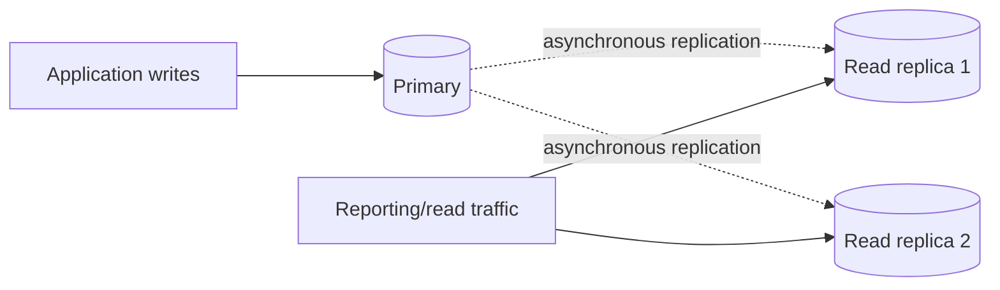

### Why replicas exist

If analytics and reporting share the writer's CPU and I/O, they can slow customer transactions. Directing suitable `SELECT` traffic to a replica isolates much of that read workload.

Read replicas can be placed in the same AZ, another AZ, or—where supported—another Region. The application must use the replica endpoint or a routing layer; simply creating a replica does not redirect queries automatically.

Important behavior:

- Writes still go to the writer/source.
- Replica data is **eventually consistent** because replication can lag.
- A read immediately after a write might not see the new value on a replica.
- A replica can be promoted to an independent database, but promotion changes its replication relationship and is not the same mechanism as classic Multi-AZ automatic failover.
- The maximum number and topology of replicas vary by engine, version, Region, and deployment type. Do not apply Aurora's “up to 15” number to all RDS engines.
- A source that is itself Multi-AZ can have read replicas. Availability and read scaling are independent choices.

### Network-cost clue

AWS currently does not charge RDS data-transfer fees for replication between a source and read replica in different AZs of the **same Region**. Cross-Region replication incurs cross-Region data-transfer charges. Always verify current pricing; the architectural distinction is same-Region HA/scale versus cross-Region DR/locality.

## Multi-AZ vs Read Replica

| Question | Multi-AZ DB instance | Read replica |
| --- | --- | --- |
| Main purpose | High availability | Read scaling; sometimes a DR building block |
| Replication | Synchronous in the classic model | Asynchronous |
| Normal reads | Classic standby: no | Yes |
| Endpoint use | Application keeps using the DB endpoint through failover | Application deliberately connects to replica endpoint |
| Failover | RDS automatic for qualifying failures | Promotion/routing must be part of the design |
| Freshness | Designed to protect committed data in the HA topology | Lag and stale reads are possible |
| Cross-Region | Not by itself | Supported for selected engines/configurations |

**Exam elimination method:**

- “Increase availability,” “automatic failover,” or “survive AZ loss” → Multi-AZ.
- “Reporting,” “read-heavy,” “scale `SELECT`,” or “offload analytics” → read replica.
- Both requirement families → combine the mechanisms or select an architecture that explicitly provides both.

## RDS Custom

Standard RDS deliberately prevents SSH access to the underlying host. RDS Custom exists for supported Oracle and Microsoft SQL Server workloads that require access to the operating system and database environment for legacy, packaged, or specialized customization.

RDS Custom can allow administrators to:

- Reach the underlying EC2 host using approved mechanisms such as AWS Systems Manager and, where configured, SSH.
- Install supported custom software or patches.
- Change settings that standard RDS does not expose.
- Enable required native or third-party features within the service's constraints.

This freedom creates responsibility. RDS Custom continuously monitors whether the instance stays inside a **support perimeter**. Unsupported changes can place it in an `unsupported-configuration` state.

Before customization:

1. Understand the engine-specific support perimeter.
2. Take an appropriate snapshot or recovery checkpoint.
3. Pause/deactivate RDS Custom automation only as documented and for the shortest necessary period.
4. Perform and validate the change.
5. Resume automation and confirm the instance returns to a supported state.

| Standard RDS | RDS Custom | Database on EC2 |
| --- | --- | --- |
| AWS manages OS; no host login | Controlled host/database customization | Full control |
| Lowest host-operations burden | Shared operational burden and support perimeter | You own nearly everything |
| Best when exposed settings are sufficient | Best for supported legacy/specialized Oracle or SQL Server needs | Best when managed-service constraints cannot be accepted |

## RDS Backups, Snapshots, and Restore

### Automated backups

For an RDS DB instance, automated backups combine periodic storage snapshots with transaction logs. Logs are uploaded frequently—currently about every five minutes for supported engines—so point-in-time recovery can restore to a selected second within the restorable window, subject to the latest restorable time.

Key points:

- DB instance automated-backup retention can be configured from 0 to 35 days; `0` disables it.
- A Multi-AZ DB cluster uses a 1-to-35-day range; automated backups cannot be disabled by setting `0` there.
- Console and API/CLI defaults can differ.
- Changing a DB instance between `0` and a nonzero retention period can cause an outage.
- Automated backups are not created while a DB instance or cluster is stopped.

### Manual DB snapshots

Manual snapshots are initiated by a user or automation and remain until explicitly deleted. They are valuable before risky changes, for long-term retention, and for controlled copies. They cost storage and are not magically validated; a restore drill proves far more than a successful “snapshot created” event.

### Restore creates a new database

Restoring an RDS or Aurora snapshot/PITR does not overwrite the existing database in place. It creates a new DB instance or cluster. Recovery therefore includes:

1. Restore to new infrastructure.
2. Validate data, schema, users, parameters, and application behavior.
3. Update routing, configuration, or DNS safely.
4. Preserve the old environment until rollback is no longer needed.

### Import paths mentioned in migration scenarios

- For supported RDS for MySQL workflows, a native backup stored in S3 can seed a new DB instance according to the documented import procedure.
- An Aurora MySQL-Compatible cluster can be created from compatible Percona XtraBackup files in S3, subject to supported versions and file-format constraints.

These mechanisms are migration/restore paths, not a universal “attach any backup from S3” feature. Check the engine-specific procedure.

### Stopped-instance cost trap

Stopping a supported RDS DB instance pauses its DB instance-hour charge, but storage, provisioned IOPS, and backup storage can continue to incur charges. RDS also automatically restarts a stopped DB instance after the service's maximum stop period. For a database that will remain unused for a long time, a snapshot-and-delete/restore-later strategy may cost less—but only after validating retention, restore time, dependencies, and deletion protection.

## RDS Security

Security is layered; no single checkbox replaces the others.

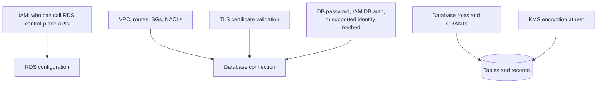

### At-rest encryption

RDS and Aurora can encrypt database storage, logs, automated backups, and snapshots with AWS KMS. Read-replica encryption rules depend on engine and whether replication is same-Region or cross-Region.

The standard migration pattern for an existing unencrypted database is:

```text
unencrypted DB
  → take snapshot
  → copy snapshot with encryption enabled
  → restore encrypted snapshot to a new DB
  → validate and cut over
```

KMS key policy and grants are part of availability. A perfectly healthy encrypted snapshot is unusable if the restoring principal cannot use its KMS key.

### In-transit encryption

RDS engines support TLS, but “TLS-capable” is not the same as “the client validated the server certificate.” Configure the client to require encryption and validate the AWS trust chain. Rotate client trust before an RDS certificate-authority expiry.

### Authentication and authorization

- Database-native username/password authentication is broadly available.
- IAM database authentication is supported only for specified engines, versions, and configurations. It provides short-lived authentication tokens; it does not replace database-level grants.
- Store long-lived credentials in Secrets Manager and rotate them where the workload supports it.
- IAM policies controlling RDS API actions do not automatically grant SQL access inside the database.

### Logging and audit

Supported engine logs can be exported to CloudWatch Logs. Depending on engine and configuration, these may include general, error, slow-query, audit, or upgrade logs. CloudTrail records RDS control-plane API activity; it is not a transcript of every SQL query.

### Host access

There is no SSH access to standard RDS or Aurora hosts. RDS Custom is the deliberate exception for its supported engines and support model.

## Amazon RDS Proxy

Applications—especially Lambda functions or rapidly scaling services—can create more concurrent database connections than the engine handles efficiently. Each connection consumes database memory and CPU, even when little useful work is occurring.

RDS Proxy is a managed, highly available database proxy that pools and shares established connections.

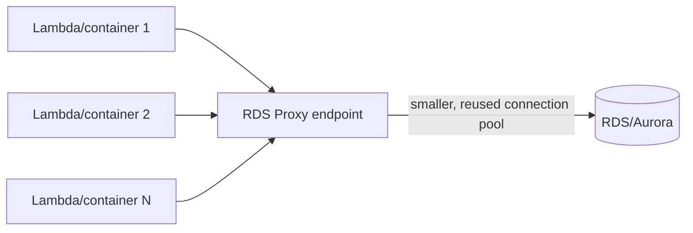

Benefits include:

- Absorbing connection surges and reducing connection setup churn.
- Preserving or redirecting application connections during supported failovers.
- Bypassing stale DNS-cache behavior; AWS documents failover-time reductions of up to 66% for RDS Multi-AZ DB instances in applicable cases.
- Enforcing IAM authentication for clients to the proxy.
- Connecting from the proxy to the database with IAM database authentication or credentials stored in Secrets Manager, as supported.

Constraints and traps:

- Engine/version/Region support varies.
- The proxy is reached inside a VPC; it is not a public internet database gateway.
- Some session behavior can **pin** a client to one database connection, reducing multiplexing benefits.
- It cannot fix slow SQL, lock contention, insufficient DB capacity, or a poor schema.
- “Most applications need few/no query changes” does not mean no configuration or connection-endpoint change.

## RDS Monitoring and Performance Analysis

When an RDS database slows down, classify the resource before resizing:

| Signal | Possible interpretation | Next checks |
| --- | --- | --- |
| High CPU | Expensive queries, missing indexes, too much concurrency | Top SQL, query plans, engine wait events |
| Low `FreeableMemory` / swapping | Working set too large, connection pressure | Buffer/cache behavior, connections, instance class |
| Low `FreeStorageSpace` | Table/index/log growth | Growth source, retention, autoscaling maximum |
| High read/write latency or queue depth | Storage bottleneck or burst exhaustion | IOPS, throughput, access pattern, storage type |
| High `DatabaseConnections` | Pool leak, scaling burst, undersized connection budget | Application pools, RDS Proxy, idle sessions |
| Replica lag | Replica cannot apply changes fast enough | Source write rate, replica capacity, long transactions |
| Deadlocks/locks | Conflicting transaction order or long transactions | Lock graph, transaction scope, retry design |

Useful observability sources include CloudWatch metrics, RDS events, engine logs, Enhanced Monitoring, and Database Insights/Performance Insights capabilities as currently offered for the engine and Region.

---

# Part II — Amazon Aurora

## What Aurora Is

Aurora is an AWS-designed relational database engine compatible with MySQL or PostgreSQL protocols and common tooling. It is proprietary AWS technology rather than the upstream MySQL or PostgreSQL server installed on an EC2-backed RDS instance.

Compatibility means many existing drivers and applications work, but it does not mean byte-for-byte identity with community MySQL/PostgreSQL. Before migration, validate engine versions, extensions, SQL behavior, parameters, replication, plugins, and operational tooling.

AWS advertises Aurora as capable of up to five times the throughput of standard MySQL and up to three times the throughput of standard PostgreSQL on comparable cloud hardware for specified benchmarks. Treat these as **up-to service claims**, not guaranteed acceleration for every query. Benchmark the actual workload.

## Aurora Architecture: Compute Separate from Distributed Storage

Traditional engines often couple a DB instance closely with its attached storage and replicate changes between database servers. Aurora separates the database compute instances from a shared cluster volume.

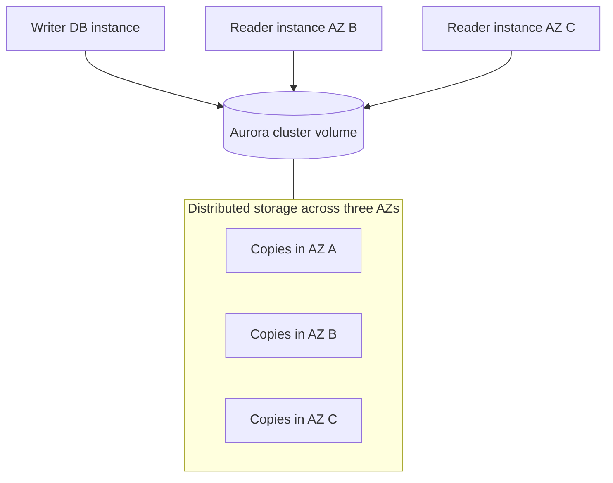

Aurora divides the volume into 10-GiB segments. Each segment is replicated six ways across three AZs. The storage layer is self-healing and continuously checks and repairs data blocks and disks.

The quorum model is commonly summarized as:

- Four of six copies are needed to maintain write availability.
- Three of six copies are needed to maintain read availability.
- Aurora is designed to tolerate loss of two copies without losing write availability and loss of three copies without losing read availability.

This is the corrected model; there are **six**, not eight, storage copies.

Storage automatically grows as the dataset grows, up to the supported maximum for the engine version/configuration (currently as high as 256 TiB for supported Aurora configurations). The logical cluster volume is presented to the writer and readers without requiring each reader to maintain a separate full storage copy through engine-level replication.

## Writer, Replicas, and Failover

An Aurora cluster has one writer at a time. It may have up to 15 Aurora Replicas in a Region. Replicas share the cluster volume, serve reads, and can be failover candidates.

If the writer fails:

1. Aurora detects the failure.
2. It selects a healthy replica according to promotion priority and availability.
3. That replica becomes the writer.
4. The cluster writer endpoint is updated to target it.
5. Applications reconnect and retry interrupted work.

AWS states failover typically completes within 30 seconds when an eligible replica exists, but this is not a contractual “instantaneous” guarantee. With no Aurora Replica, the service must create replacement compute, so recovery can take longer and may be constrained by an AZ-wide failure. For production high availability, use at least one appropriately sized replica in another AZ.

## Aurora Endpoints

| Endpoint | Routes to | Correct use | Trap |
| --- | --- | --- | --- |
| Cluster/writer endpoint | Current writer | Read/write traffic that needs the writer | Do not hard-code the current writer's instance endpoint. |
| Reader endpoint | Available Aurora Replicas; writer only if no replicas exist | Read balancing | It balances **connections**, not individual queries; clients still need sensible pooling. |
| Instance endpoint | One specific DB instance | Administration, diagnostics, workload pinning | Loses role abstraction during failover. |
| Custom endpoint | A chosen subset of DB instances | Isolate analytics or particular instance classes | You manage membership and routing intent. |

```text
transactional writes and read-after-write paths → writer endpoint
eventually consistent general reads           → reader endpoint
heavy analytics on selected large replicas    → custom endpoint
```

Defining a custom endpoint does not make the reader endpoint invalid. Both can coexist for different workload classes.

## Aurora Replica Auto Scaling

Aurora Auto Scaling can adjust the number of Aurora Replicas within configured minimum and maximum capacity based on a target metric such as average CPU or average connections. New replicas are included behind the reader endpoint after they become available.

It helps with sustained or predictable read-pressure changes, but it is not instantaneous:

- A new DB instance takes time to provision.
- A sudden spike can arrive before scale-out completes.
- Scale-in must not remove capacity required for availability.
- The application must actually send reads to the reader endpoint.

## Aurora Serverless v2

Aurora Serverless v2 expresses compute in Aurora Capacity Units (ACUs) and can scale capacity within a configured range. It uses the same distributed Aurora storage architecture and participates in Aurora's high-availability model according to the cluster topology.

Good candidates include:

- Variable, spiky, or hard-to-predict workloads.
- Development/test databases with fluctuating activity.
- Multi-tenant applications whose aggregate demand changes.
- Workloads where fine-grained automatic compute scaling is worth the price/behavior tradeoff.

It does not remove database design or capacity planning entirely. You still define minimum/maximum ACUs, replicas, connection strategy, and failover architecture. A workload that remains busy continuously may be more predictable or cost-effective on provisioned instances. Verify supported engines, versions, Regions, scaling ranges, and feature combinations.

## Aurora Global Database

Aurora Global Database spans multiple Regions using storage-based physical replication:

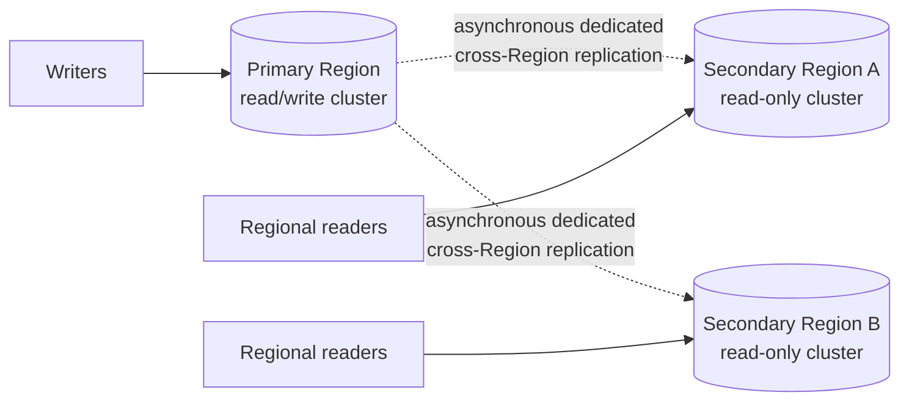

Current documented characteristics include:

- One primary Region accepts writes.
- Up to 10 read-only secondary Regions are supported for current compatible configurations.
- Replication latency is typically under one second, not guaranteed zero.
- A secondary cluster can scale local reads with Aurora reader instances; current Aurora MySQL Global Database documentation permits up to 16 readers in a secondary cluster in applicable configurations.
- Managed switchover supports planned Region changes; managed failover supports unplanned recovery.

### RPO/RTO honesty

Cross-Region replication is asynchronous. If the primary Region disappears before the latest changes reach a secondary, some committed data can be absent after failover. AWS's current DR guide describes RPO typically in seconds and RTO in the order of minutes. Older shorthand such as “RTO under one minute” is a capability/marketing target for certain operations, not a safe universal guarantee.

Use Global Database when global read latency or Region-level DR justifies its cost and operational plan. Practice the failover, application routing, credential, secret, and dependency changes; a database copy alone does not make the entire application multi-Region.

## Aurora Backtrack

Backtrack can rewind a supported Aurora MySQL-Compatible cluster to an earlier time **without restoring a new cluster from a backup**. It is useful after a destructive statement such as `DELETE` without a `WHERE` clause.

Important limits:

- It is an Aurora MySQL-Compatible feature, not a general RDS/Aurora PostgreSQL feature.
- It must be enabled when the cluster is created or when a snapshot is restored; it cannot simply be enabled later on the same cluster.
- The current maximum backtrack window is 72 hours.
- It rewinds the entire cluster, not one table.
- It closes connections and briefly disrupts the database.
- It is not a replacement for backups or cross-Region recovery.

```text
Operator mistake
  → Backtrack rewinds the existing cluster quickly
  → lower recovery time than full restore in eligible cases
  → but all cluster data returns to the selected consistent point
  → downstream systems and replay strategy must be considered
```

## Aurora Backup, Restore, and Cloning

Aurora automated backups are continuous and incremental, with a retention period currently configurable from 1 to 35 days; they cannot be disabled. PITR and snapshot restore create a new cluster.

An Aurora clone uses copy-on-write storage to create a new cluster quickly without initially copying all data blocks. It is useful for development, testing, or pre-change validation. As source and clone diverge, changed blocks consume additional storage. A clone is not an independent backup strategy because it initially shares underlying storage ancestry and resides within the service's cloning constraints.

## Aurora Machine Learning Integration

Aurora Machine Learning allows supported Aurora MySQL/PostgreSQL configurations to invoke selected AWS machine-learning endpoints from SQL. Documented integrations have included Amazon SageMaker AI endpoints for custom models and Amazon Comprehend for natural-language analysis.

Possible uses include fraud scoring, sentiment analysis, recommendations, and ad targeting. This feature does not eliminate model development, endpoint cost, IAM configuration, network design, latency analysis, or version/Region compatibility. Verify current integration support before choosing it in a design.

## Babelfish for Aurora PostgreSQL

Babelfish adds a Tabular Data Stream (TDS) endpoint and support for commonly used T-SQL behavior to Aurora PostgreSQL-Compatible Edition. It can let a SQL Server application connect with its existing SQL Server driver and migrate with fewer code changes than a traditional engine conversion.

```text
SQL Server application
  → TDS / T-SQL connection on port 1433
  → Babelfish compatibility layer
  → Aurora PostgreSQL storage and engine
```

It is a migration aid, not a perfect SQL Server emulator. Unsupported T-SQL, SQL Server features, extensions, semantics, and service integrations must be assessed. AWS DMS and assessment tooling can help move data and identify gaps, but application testing remains mandatory.

## RDS vs Aurora

| Dimension | Standard RDS engine | Aurora |
| --- | --- | --- |
| Engine | Managed community/commercial engine | AWS-designed MySQL- or PostgreSQL-compatible engine |
| Storage model | Deployment/engine-specific managed storage | Shared distributed cluster volume across three AZs |
| Read scale | Engine-specific read replicas and limits | Up to 15 in-Region Aurora Replicas |
| Failover | Multi-AZ topology dependent | Replica promotion with shared storage |
| Maximum compatibility | Usually closer to selected upstream/commercial engine | Compatibility is substantial but not identical |
| Global pattern | Cross-Region replicas where supported | Aurora Global Database |
| Selection reason | Compatibility, licensing, features, cost, familiarity | Aurora architecture, throughput, replica/failover/global capabilities |

Never choose from a fixed statement such as “Aurora always costs 20% more.” Pricing depends on instance/ACU capacity, I/O configuration, storage, backup, data transfer, replicas, Region, and workload. Model total cost with current pricing and measured I/O.

---

# Part III — Amazon ElastiCache

## What ElastiCache Is

Amazon ElastiCache is a managed in-memory data service. As of the source-review date, it supports:

- **Valkey**, the open-source Redis-compatible engine AWS now emphasizes.
- **Redis OSS** for supported versions/deployment paths.
- **Memcached**.

AWS manages much of the provisioning, node replacement, monitoring integration, patching, and supported backup/failure-recovery machinery. The application must still understand cache keys, serialization, TTLs, invalidation, eviction, topology, retries, and failure behavior.

Adding ElastiCache usually requires application changes. The application must check the cache, handle a miss, populate/update/invalidate keys, and remain correct when the cache is unavailable.

## The Cache-Aside (Lazy Loading) Pattern

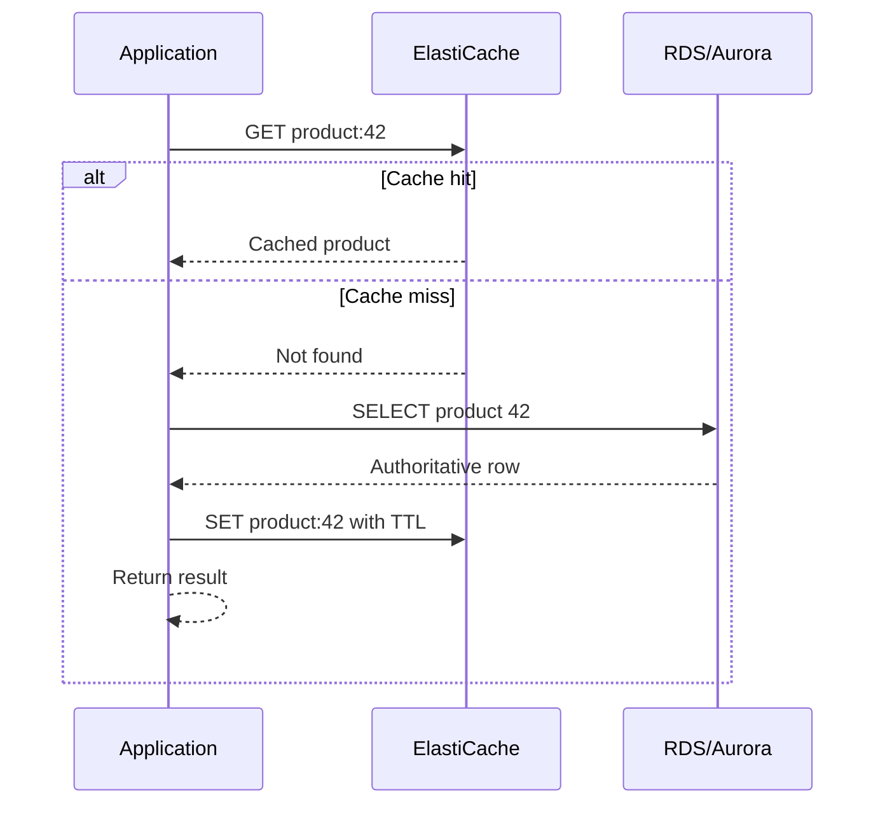

Advantages:

- Only requested data is cached.
- A cache failure can often degrade to database reads rather than corrupting truth.
- Simple to introduce incrementally.

Costs:

- The first request after expiration is slower.
- Multiple simultaneous misses can create a **cache stampede**.
- Cached values can become stale after database updates.

Mitigations include TTL jitter, request coalescing/locking, stale-while-revalidate designs, prewarming, and carefully bounded fallback traffic.

## Write-Through and Invalidation

In a write-through-style application flow, a successful write updates the durable database and then updates or invalidates the cache.

```text
write request
  → commit authoritative database transaction
  → invalidate or refresh affected cache key
  → subsequent reads use fresh value
```

This reduces stale reads but creates a dual-write problem: what happens if the database commit succeeds and cache update fails? A robust design treats the database as truth and can reconstruct the cache. Change events, an outbox pattern, retry queues, or conservative invalidation can make recovery reliable.

“Write-through means no stale data” is too absolute. Races, failed invalidations, replicas, TTLs, and ordering can still produce stale observations.

## Session Store Pattern

If each application server keeps sessions only in local memory, a user routed to another server appears logged out. A shared cache lets every healthy application instance retrieve the same short-lived session.

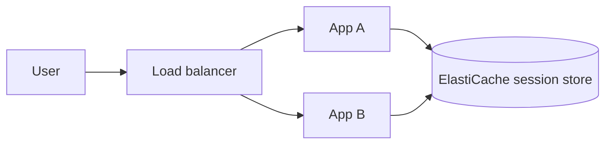

This helps make application instances **stateless with respect to sessions**, enabling replacement and horizontal scaling. Define TTL, logout invalidation, encryption, token/session revocation, and behavior when the cache fails. Highly valuable sessions may require a durable backing design rather than cache-only storage.

## Valkey/Redis OSS vs Memcached

| Capability | Valkey / Redis OSS | Memcached |
| --- | --- | --- |
| Data structures | Strings, hashes, lists, sets, sorted sets, streams and more (version dependent) | Simple key/value objects |
| Threading/model | Command execution architecture depends on engine/version; rich server-side operations | Multithreaded, simple distributed cache |
| Replication/HA | Replication groups, read replicas, Multi-AZ automatic failover when configured | No node-to-node replication; losing a node loses its keys until repopulated |
| Partitioning | Cluster mode/shards or serverless scaling | Client-side distribution across nodes; serverless option available |
| Persistence/backup | Snapshots for supported Valkey/Redis OSS deployments | Traditional node-based Memcached is ephemeral; Serverless Memcached supports snapshot/restore |
| Typical uses | Leaderboards, sessions, counters, rate limits, pub/sub, rich cache logic | Simple horizontally distributed object cache |

Do not answer from the outdated rule “Memcached never has backup.” AWS currently supports snapshot and restore for **Serverless Memcached**, while node-based Memcached remains an ephemeral cache without replication.

## Leaderboard Example

A gaming leaderboard needs uniqueness and ordering by score. A Valkey/Redis OSS **sorted set** stores each member once and maintains ranking by score. Updating a player's score updates the ordering without the application repeatedly sorting the entire player population.

This is a strong exam clue:

```text
real-time leaderboard + ranking + uniqueness → sorted set in Valkey/Redis OSS
```

## Cache Security

ElastiCache security has two planes:

1. **Control plane:** IAM determines who can create, modify, tag, snapshot, or delete caches through AWS APIs.
2. **Data plane:** network controls and engine authentication determine which clients can read/write cached data.

Security controls include:

- Private VPC placement and restrictive security groups.
- Encryption in transit (TLS) and at rest where supported.
- Valkey/Redis OSS AUTH or RBAC, depending on engine/deployment/version.
- IAM authentication for Valkey 7.2+ and Redis OSS 7.0+ under current documented requirements; TLS is required, tokens are short-lived, and other limitations apply.
- SASL authentication for supported Memcached deployments/configurations.

An IAM permission such as `elasticache:DescribeCacheClusters` does not by itself authorize a client to run `GET` against the cache. Conversely, a cache password must not grant permission to change AWS infrastructure.

## TTL, Eviction, and Memory Pressure

TTL bounds how long a key remains eligible to be served. It is a business freshness decision, not merely a performance setting.

Examples:

- Product description: perhaps minutes.
- One-time authorization state: perhaps seconds.
- User session: aligned with security/session policy.
- Never-changing reference data: long TTL plus explicit invalidation.

When memory fills, the engine's eviction policy determines which keys may be removed. A cache can therefore miss before TTL expiry. Monitor memory, evictions, hit rate, latency, connections, and replication state.

### Cache invalidation strategies

| Strategy | Benefit | Failure/tradeoff |
| --- | --- | --- |
| TTL only | Simple; eventually refreshes | Stale until expiry; simultaneous expiry can stampede |
| Delete key after DB write | Next read reconstructs from truth | Failed delete leaves stale data |
| Update key after DB write | Keeps cache warm | Dual-write ordering/failure complexity |
| Versioned keys | Old and new values do not collide | Orphan cleanup and version propagation |
| Event-driven invalidation | Decouples producers/consumers | Event loss, duplication, ordering, and lag must be handled |

## ElastiCache Failure Modes

| Failure | Effect | Correct design response |
| --- | --- | --- |
| Cache node unavailable | Misses/errors and possible loss of ephemeral keys | Retry with bounds, HA topology where needed, controlled DB fallback |
| Mass expiration | Cache stampede overloads database | TTL jitter, coalescing, prewarming, rate limiting |
| Stale value | User sees old data | Better TTL/invalidation/versioning |
| Hot key | One shard/node becomes bottleneck | Replication, key sharding, local cache, request coalescing |
| Memory exhaustion | Evictions or write failures, policy dependent | Capacity, eviction policy, object sizing, TTL discipline |
| Failover | Brief reconnect/errors | Topology-aware client, timeouts, retry/backoff |
| Serialization mismatch after deployment | New code cannot decode old cache entries | Version keys/payloads and support rolling compatibility |

---

# Part IV — Integrated Design, Operations, and Exam Method

## RDS/Aurora with ElastiCache: Data Flow

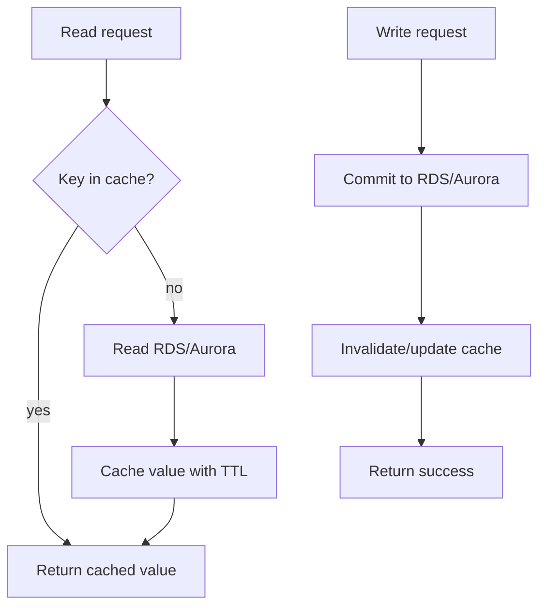

The database remains authoritative. If cache mutation fails after the database commit, the system should repair or expire the cache rather than rolling truth backward casually.

## Practical Architecture Scenarios

### Scenario 1: Highly available transactional application

Requirements: relational transactions, one-Region AZ resilience, moderate traffic.

Design:

- RDS Multi-AZ or a suitably multi-instance Aurora cluster.
- Private DB subnets across AZs.
- Application instances across AZs.
- TLS, Secrets Manager/IAM auth where supported, restrictive security groups.
- Tested reconnect/retry logic and restore drills.

Why not a read replica alone? It does not provide the same automatic HA semantics and may lag.

### Scenario 2: Reporting harms checkout performance

Requirements: transactional writer must remain responsive; reports tolerate slightly stale data.

Design:

- Add a read replica.
- Send reporting connections to the replica endpoint.
- Monitor replica lag.
- Keep checkout reads that require latest committed state on the writer.

Why not Multi-AZ alone? The classic standby does not serve reporting reads.

### Scenario 3: Lambda connection storm

Requirements: thousands of short function invocations, modest query volume, DB connection exhaustion.

Design:

- Place functions in the required VPC networking path.
- Use RDS Proxy for a supported engine.
- Bound function concurrency and tune the proxy/database connection budget.
- Store credentials in Secrets Manager or use supported end-to-end IAM authentication.

Why not ElastiCache alone? The immediate bottleneck is connection count, not necessarily repeated data reads.

### Scenario 4: Global users and Region-level DR

Requirements: low-latency reads in several Regions and a relational secondary for disaster recovery.

Design:

- Aurora Global Database where compatibility fits.
- Reads served from secondary-Region readers.
- Writes routed to the primary Region/global writer endpoint.
- A rehearsed managed switchover/failover runbook.
- Explicit RPO acceptance for asynchronous cross-Region replication.

### Scenario 5: Product catalogue receives extreme repeated reads

Requirements: catalogue changes infrequently, requests are huge, low latency is important.

Design:

- RDS/Aurora as source of truth.
- ElastiCache cache-aside with TTL and invalidation on product changes.
- TTL jitter/request coalescing to prevent stampedes.
- Database capacity for a controlled cache-degraded mode.

## Database and Network Ports

Ports are defaults, not proof that a service is healthy or secure. RDS endpoints can use a custom port, and security groups must explicitly permit the chosen one.

| Protocol/engine | Common default port | Why it matters |
| --- | ---: | --- |
| FTP | 21 | Legacy file transfer; not a database port |
| SSH/SFTP | 22 | Host shell/secure file transfer; unavailable for standard RDS host access |
| HTTP | 80 | Unencrypted web traffic |
| HTTPS | 443 | TLS web/API traffic |
| PostgreSQL / Aurora PostgreSQL | 5432 | PostgreSQL client connection |
| MySQL / MariaDB / Aurora MySQL | 3306 | MySQL-protocol client connection |
| Oracle | 1521 | Common Oracle listener default |
| Microsoft SQL Server | 1433 | SQL Server/TDS default; also Babelfish TDS default |
| Db2 | 50000 | Common Db2 TCP service default; deployment can differ |
| Valkey/Redis OSS | 6379 | Common non-TLS default; managed endpoint/config can differ |
| Memcached | 11211 | Common Memcached default |

The exam generally tests whether you distinguish an HTTPS path from a database connection path, not whether you can recite every port.

## Small Details That Matter Later

1. **Endpoint means DNS, not a permanent server.** Failover changes the target. Clients that cache DNS indefinitely or never reconnect can remain broken after AWS has recovered the database.
2. **A replica is not automatically used.** The application or data-access layer must route reads to it.
3. **Read-after-write consistency matters.** A user who just changed a password or placed an order may need to read from the writer, not an asynchronous replica/cache.
4. **Classic Multi-AZ standby and Multi-AZ DB cluster are different topologies.** Read the wording.
5. **Aurora storage HA exists even with one compute instance, but compute HA does not.** Add an Aurora Replica in another AZ for fast promotion.
6. **Aurora's reader endpoint balances connections.** One enormous connection pool may not distribute as expected.
7. **Promotion tiers matter.** An analytics replica with different capacity can become writer unless priorities are designed.
8. **PITR creates new infrastructure.** Recovery includes cutover, secrets, endpoints, and validation.
9. **Backtrack rewinds the whole eligible Aurora MySQL cluster.** It is not a table-level undo button and not a backup replacement.
10. **Encryption and KMS permissions travel together.** Losing key access can make backup data operationally unavailable.
11. **RDS Proxy connection pinning reduces multiplexing.** Stateful session behavior can neutralize expected pooling gains.
12. **Caches can evict unexpired keys.** TTL does not guarantee presence.
13. **A cache is not made durable merely because snapshots exist.** Its serving/failure semantics remain cache-oriented.
14. **Serverless is not automatically cheapest.** Cost follows actual ACUs, I/O, storage, and usage pattern.
15. **Exact limits drift.** Replica count, storage maximum, backup support, versions, and Regions must be verified during design.

## Common Misunderstandings

| Misunderstanding | Correct model |
| --- | --- |
| “RDS is just a database running on an EC2 instance I can administer.” | RDS exposes a managed service boundary; standard RDS does not provide host login. |
| “Multi-AZ makes reads faster.” | Classic Multi-AZ is for HA; use read replicas for read scaling. |
| “A read replica is always current.” | Asynchronous replicas can lag. |
| “Creating a replica automatically balances queries.” | The application must use the correct endpoint/routing. |
| “Aurora is exactly MySQL/PostgreSQL.” | It is compatible, not identical. Validate features and semantics. |
| “Aurora failover is instantaneous.” | It is designed to be fast, typically within tens of seconds with a replica, but clients still reconnect. |
| “Aurora stores eight copies.” | It stores six copies of each 10-GiB segment across three AZs. |
| “ElastiCache makes an application stateless automatically.” | A shared session store can remove local session state, but the application must implement the pattern. |
| “Write-through guarantees no stale data.” | Failures and races still require ordering and repair logic. |
| “IAM permission to manage ElastiCache grants key access.” | Control-plane IAM and data-plane authentication are distinct. |

## Failure Modes / Mistakes / Traps

### Availability traps

- Selecting a read replica when the question explicitly requires automatic failover.
- Deploying one Aurora DB instance and assuming distributed storage alone provides compute failover.
- Ignoring application reconnect, retry, transaction ambiguity, and DNS behavior.
- Calling Multi-AZ “disaster recovery” without distinguishing AZ-level HA from Region-level DR.

### Performance traps

- Scaling the instance without examining query plans and locks.
- Sending strongly consistent reads to an asynchronous replica.
- Creating RDS Proxy when SQL itself is the bottleneck.
- Adding a cache without measuring hit rate or defining keys and TTLs.
- Letting every application instance create an unbounded connection pool.

### Security traps

- Making the database publicly accessible for convenience.
- Allowing `0.0.0.0/0` to a database/cache port.
- Enabling TLS but not requiring certificate validation in clients.
- Storing master credentials in source code or an AMI.
- Assuming KMS encryption prevents an authorized database user from reading rows.

### Recovery traps

- Keeping snapshots but never testing restore.
- Forgetting that restored databases receive new endpoints.
- Deleting a source before validating the restored target.
- Treating a same-Region standby as a Region-disaster plan.
- Ignoring cache warm-up load after a flush or failover.

## Debugging / Analysis Method

### Application cannot connect to RDS/Aurora

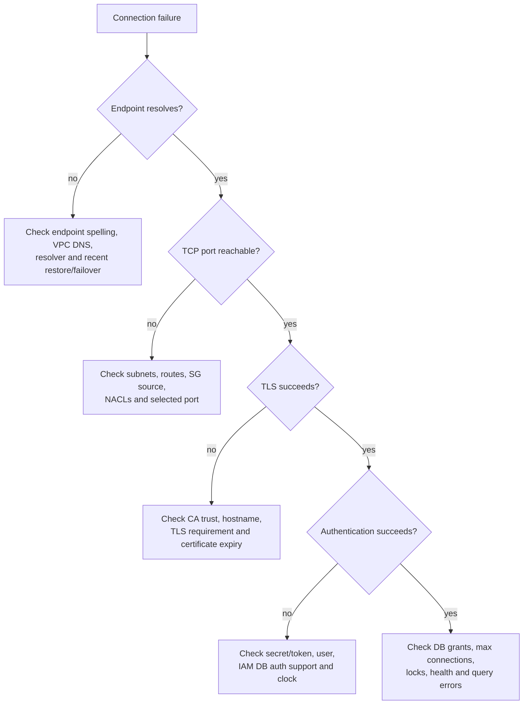

### Database is slow

1. Establish the time window and affected operations.
2. Compare CPU, memory, storage latency/queue, connections, and network metrics.
3. Identify top SQL and wait events.
4. Check query plans, indexes, locks, long transactions, and table growth.
5. Check replicas and cache behavior only if the application uses those paths.
6. Scale only after identifying what resource or design is constrained.

### Reads are stale

Trace the exact read path:

```text
application local cache?
  → ElastiCache key and TTL?
  → RDS/Aurora read replica and lag?
  → transaction isolation/session state?
  → writer's latest committed value?
```

Do not “fix” staleness by flushing every cache and routing every read to the writer without understanding the consistency requirement and load consequence.

### Cache miss rate suddenly rises

Check:

- Deployment accidentally changed key prefix or serialization version.
- TTLs expired together.
- Memory pressure caused evictions.
- A node/shard failed or topology changed.
- Client discovery/routing is stale.
- Hot keys shifted or cache was flushed.
- The database can safely absorb fallback load before bypassing the cache.

## Practical AWS CLI Inspection Examples

These commands are read-only. They inspect configuration; they do not prove that a client can authenticate or that recovery works.

### Inspect an RDS instance

```bash
aws rds describe-db-instances \
  --db-instance-identifier app-prod-db \
  --query 'DBInstances[0].{Status:DBInstanceStatus,Engine:Engine,MultiAZ:MultiAZ,Endpoint:Endpoint.Address,Port:Endpoint.Port,Encrypted:StorageEncrypted,BackupDays:BackupRetentionPeriod}'
```

- `--db-instance-identifier` selects one instance.
- `--query` limits output to important fields.
- Healthy output usually shows `Status` as `available`; another state is not automatically bad, but must be interpreted (for example, `modifying`, `backing-up`, or `rebooting`).
- This output does not test security groups, TLS, credentials, SQL health, or restore readiness.

### Inspect replica lag metrics

```bash
aws cloudwatch get-metric-statistics \
  --namespace AWS/RDS \
  --metric-name ReplicaLag \
  --dimensions Name=DBInstanceIdentifier,Value=app-reporting-replica \
  --statistics Average Maximum \
  --period 300 \
  --start-time 2026-08-17T00:00:00Z \
  --end-time 2026-08-17T01:00:00Z
```

- Replace the timestamps and identifier; hard-coded old timestamps return old or empty data.
- `Average` can hide spikes, so compare `Maximum`.
- Metric availability/meaning varies by engine and topology.

### Inspect an ElastiCache replication group

```bash
aws elasticache describe-replication-groups \
  --replication-group-id app-cache \
  --query 'ReplicationGroups[0].{Status:Status,AutomaticFailover:AutomaticFailover,ClusterEnabled:ClusterEnabled,Endpoint:ConfigurationEndpoint.Address}'
```

- `available` is the normal steady state.
- A null configuration endpoint can be normal for a non-cluster-mode topology; inspect the primary/reader endpoints instead.
- The command does not execute an authenticated cache `GET` or validate application TLS behavior.

## Real-World and SAA Exam Relevance

### Question-decoding table

| Scenario wording | Likely service feature | Why |
| --- | --- | --- |
| “Automatic failover across AZs” | RDS Multi-AZ / multi-instance Aurora | Availability requirement |
| “Offload reporting queries” | Read replica | Read-scale requirement |
| “Global low-latency reads with relational data” | Aurora Global Database | Storage-based cross-Region replication/local readers |
| “Thousands of Lambda connections exhaust DB” | RDS Proxy | Connection pooling/surge absorption |
| “Infrequent unpredictable relational workload” | Aurora Serverless v2, after checking constraints | Fine-grained compute scaling |
| “Undo accidental delete quickly without new restore” | Aurora MySQL Backtrack, if enabled/supported | Rewinds eligible cluster |
| “Real-time gaming ranking” | Valkey/Redis OSS sorted set | Ordered unique members by score |
| “Shared session across stateless web fleet” | ElastiCache | Central short-lived session lookup |
| “Simple distributed object cache, rich structures unnecessary” | Memcached | Simple multithreaded key/value cache |
| “Needs OS-level database customization” | RDS Custom for supported engines, or EC2 | Standard RDS blocks host access |

### A disciplined answer method

1. Identify whether data is relational and whether this copy is authoritative.
2. Extract consistency, RPO, and RTO requirements.
3. Separate availability, read scale, write scale, connection scale, and latency.
4. Reject options that solve a different axis.
5. Check whether the application can change, because caching and replica routing require code/connection behavior.
6. Compare operational burden and cost only among technically valid options.

## Connected Topics

- [[5 - EC2 Instance Storage]] — storage performance vocabulary and durability boundaries.
- [[6 - High Availability and Scalability ELB and ASG]] — stateless application scaling and multi-AZ compute.
- [[18 - Serverless Overview from Solutions Architect Perspective]] — Lambda concurrency and database connection behavior.
- [[20 - Databases in AWS]] — DynamoDB, Redshift, Neptune, DocumentDB, and database selection beyond relational/cache services.
- [[23 - AWS Monitoring and Audit - CloudWatch, CloudTrail and Config]] — metrics, logs, API audit, and configuration tracking.
- [[25 - AWS Security and Encryption - KMS, SSM Parameter Store, Shield and WAF]] — KMS, Secrets Manager, and layered security.
- [[26 - Networking VPC]] — subnets, routing, security groups, NACLs, DNS, and private connectivity.
- [[27 - Disaster Recovery & Management]] — backup/restore, pilot light, warm standby, multi-site, RPO, and RTO.

## Chapter Summary

- RDS provides managed relational engines; AWS manages infrastructure operations, while you still own data, schema, query, access, recovery, and capacity decisions.
- Classic RDS Multi-AZ uses synchronous standby replication for high availability. Read replicas use asynchronous replication for read scale and can return stale data.
- RDS storage autoscaling protects against low free space up to a configured maximum; it does not replace growth monitoring or cost governance.
- RDS Custom supplies controlled OS/database access for supported Oracle and SQL Server workloads.
- Backups and snapshots are valuable only when restore and cutover are understood and tested.
- RDS Proxy manages connection pressure and improves failover transparency; it is not a query accelerator.
- Aurora separates compute instances from a six-copy distributed storage volume across three AZs.
- Aurora replicas serve reads and act as failover candidates; endpoints route by role.
- Serverless v2 scales compute capacity, while Global Database replicates asynchronously across Regions.
- Aurora Backtrack is an eligible Aurora MySQL rewind feature, not a replacement for backup.
- ElastiCache accelerates access and shares ephemeral state, but application logic must manage misses, TTL, invalidation, eviction, and failure.
- Valkey/Redis OSS provides rich data structures and HA options; Memcached is a simpler distributed object cache with different durability behavior.

## Questions to Test Understanding

### Conceptual questions

1. Why is a classic RDS Multi-AZ standby not the correct answer to a read-scaling problem?
2. Why can a read replica return stale data even when replication is healthy?
3. What responsibilities remain with the customer after moving a database from EC2 to RDS?
4. Why does an Aurora cluster with distributed storage but only one DB instance still have a compute-availability weakness?
5. What is the difference between Aurora's writer, reader, instance, and custom endpoints?
6. Why can RDS Proxy help Lambda workloads but not repair an unindexed query?
7. Why is restoring a snapshot more than a storage operation?
8. Why should ElastiCache normally not be the only copy of an order record?
9. How can a cache stampede occur, and name two mitigations.
10. Why is Babelfish described as a compatibility/migration aid rather than complete SQL Server replacement?

### Scenario questions

11. A checkout database must survive an AZ failure automatically. Traffic is write-heavy, and reporting is not required. Choose the primary RDS feature.
12. Analysts run large `SELECT` queries that slow customer transactions. Reports can be several seconds behind. What should be added?
13. A fleet of Lambda functions opens thousands of connections during traffic bursts, exhausting a PostgreSQL connection limit. What service directly addresses the connection problem?
14. A news homepage reads the same articles millions of times, while updates happen every few minutes. Propose a data path and freshness mechanism.
15. A company requires local relational reads in Europe and Asia and a rehearsed Region-failure plan. Writes can remain in one Region. Which Aurora capability fits, and what consistency caveat remains?
16. An administrator accidentally deletes rows from an Aurora PostgreSQL cluster. A colleague recommends Backtrack. What is wrong with the recommendation?
17. A gaming system needs continually updated unique player rankings. Which ElastiCache engine feature is the strongest clue?
18. After an RDS failover, AWS reports the DB as available but the application remains disconnected. What client-side behaviors should be investigated?
19. A team creates a cache with no TTL and never invalidates product records. What correctness failure results?
20. A legacy Oracle package requires OS agents and settings unavailable in standard RDS. Compare the two likely deployment directions.

## Answers and Reasoning

1. Classic Multi-AZ reserves the standby for synchronous HA and automatic failover; it does not expose that standby for normal application reads. A read replica targets read throughput.
2. Read-replica replication is asynchronous. A committed source change needs time to reach and be applied by the replica, so temporary lag is expected.
3. The customer still owns schema, indexes, SQL, users/grants, networking, retention, restore tests, encryption choices, capacity, cost, connection behavior, and application correctness.
4. The data survives multiple storage-copy failures, but no ready compute instance exists to promote. Aurora may need to create replacement compute, which takes longer and may be affected by the AZ incident.
5. The writer endpoint follows the current writer; the reader endpoint distributes new read connections; an instance endpoint pins a particular instance; a custom endpoint routes to a selected subset.
6. RDS Proxy pools and reuses connections, reducing connection churn. An unindexed query still consumes database CPU/I/O after it reaches the engine.
7. Restore creates a new DB/cluster with a new endpoint. The team must validate data and configuration, make secrets/routing available, cut over, and retain rollback safety.
8. A cache is designed for speed and may evict or lose keys. The durable relational database should remain the system of record for irreplaceable orders.
9. Many clients miss the same expired key simultaneously and all query the database. TTL jitter, request coalescing/locking, prewarming, or stale-while-revalidate can reduce it.
10. Babelfish implements common TDS/T-SQL behavior but has documented unsupported and different features. Compatibility assessment and application testing are required.
11. Use RDS Multi-AZ (or an appropriately highly available Aurora topology if Aurora is otherwise selected). The direct clue is automatic AZ failover, not read scaling.
12. Add a read replica and route reports to it. Monitor lag because the question permits stale reporting data.
13. RDS Proxy directly addresses database connection pooling and burst absorption; also bound concurrency and tune connection budgets.
14. Keep articles in RDS/Aurora and use ElastiCache cache-aside. Apply a TTL aligned to acceptable staleness and invalidate/update the relevant key after editorial changes.
15. Aurora Global Database provides secondary-Region reads and Region-level recovery. Cross-Region replication is asynchronous, so lag and a nonzero RPO remain possible.
16. Backtrack is an Aurora MySQL-Compatible feature, not Aurora PostgreSQL. Use PITR/snapshot recovery or another PostgreSQL-specific recovery design.
17. A Valkey/Redis OSS sorted set maintains unique members ordered by score.
18. Investigate DNS caching, stale pooled connections, lack of reconnect/retry, transaction retry safety, timeouts, and whether the application used the logical DB endpoint rather than a fixed instance/IP.
19. Users can receive indefinitely stale product data, limited only by eviction/restart. Every cached representation needs a freshness/invalidation policy.
20. Evaluate RDS Custom for supported Oracle versions if its support perimeter permits the agents/settings. Otherwise use Oracle on EC2 and accept full operational ownership; standard RDS is unsuitable when host access is mandatory.

## Rapid Revision Sheet

```text
RDS = managed relational engines
Multi-AZ = HA / automatic failover
Read replica = read scale / asynchronous / lag possible
RDS Proxy = connection pool + failover transparency
RDS Custom = controlled OS/DB customization for supported Oracle/SQL Server

Aurora = MySQL/PostgreSQL-compatible AWS engine
Aurora storage = six copies, three AZs, 4/6 write quorum, 3/6 read quorum
Writer endpoint = writes and current-state reads
Reader endpoint = connection balancing across replicas
Global Database = one write Region + asynchronous secondary Regions
Backtrack = eligible Aurora MySQL in-place rewind, not backup

ElastiCache = managed in-memory speed/state layer
Cache-aside = miss → DB → populate cache
TTL = freshness bound, not presence guarantee
Valkey/Redis OSS = rich structures, replication/HA options
Memcached = simple distributed cache; no node replication
Cache truth rule = durable DB remains authoritative
```

## Glossary

| Term | Revision definition |
| --- | --- |
| Aurora Capacity Unit (ACU) | Capacity measure used by Aurora Serverless v2, combining memory and corresponding compute/network resources. |
| Backtrack | Aurora MySQL feature that rewinds an enabled cluster without creating a restored cluster. |
| Cache stampede | Many clients miss the same key and simultaneously overload the backing system. |
| Custom endpoint | Aurora endpoint representing a chosen subset of instances. |
| DB subnet group | Set of subnets RDS may use for database placement. |
| Eventually consistent | A reader can temporarily observe an older value while replication/update propagates. |
| Failover tier | Aurora replica promotion priority. |
| Hit ratio | Proportion of cache lookups served from cache rather than the backing store. |
| Multi-AZ | RDS/Aurora placement and replication topology for availability across AZs; exact behavior depends on deployment type. |
| Parameter group | Managed collection of engine configuration parameters. |
| Read replica | Readable asynchronous copy of a database source. |
| RDS Proxy | Managed proxy that pools/shares supported RDS/Aurora connections. |
| System of record | Authoritative source from which derived/cache data can be rebuilt. |
| Writer endpoint | Aurora cluster endpoint that tracks the current writer. |

## Official References

- [Amazon RDS User Guide](https://docs.aws.amazon.com/AmazonRDS/latest/UserGuide/Welcome.html)
- [Amazon RDS database engines](https://docs.aws.amazon.com/AmazonRDS/latest/UserGuide/Welcome.html#Welcome.Concepts.DBInstance)
- [RDS storage autoscaling](https://docs.aws.amazon.com/AmazonRDS/latest/UserGuide/USER_PIOPS.Autoscaling.html)
- [RDS read replicas](https://docs.aws.amazon.com/AmazonRDS/latest/UserGuide/USER_ReadRepl.html)
- [RDS Multi-AZ deployments](https://docs.aws.amazon.com/AmazonRDS/latest/UserGuide/Concepts.MultiAZ.html)
- [RDS automated backup retention](https://docs.aws.amazon.com/AmazonRDS/latest/UserGuide/USER_WorkingWithAutomatedBackups.BackupRetention.html)
- [Amazon RDS Custom](https://docs.aws.amazon.com/AmazonRDS/latest/UserGuide/rds-custom.html)
- [Amazon RDS Proxy](https://docs.aws.amazon.com/AmazonRDS/latest/UserGuide/rds-proxy.html)
- [Amazon Aurora overview](https://docs.aws.amazon.com/AmazonRDS/latest/AuroraUserGuide/CHAP_AuroraOverview.html)
- [Aurora high availability](https://docs.aws.amazon.com/AmazonRDS/latest/AuroraUserGuide/Concepts.AuroraHighAvailability.html)
- [Aurora Global Database](https://docs.aws.amazon.com/AmazonRDS/latest/AuroraUserGuide/aurora-global-database.html)
- [Aurora Backtrack](https://docs.aws.amazon.com/AmazonRDS/latest/AuroraUserGuide/AuroraMySQL.Managing.Backtrack.html)
- [Babelfish for Aurora PostgreSQL](https://docs.aws.amazon.com/AmazonRDS/latest/AuroraUserGuide/babelfish.html)
- [Amazon ElastiCache User Guide](https://docs.aws.amazon.com/AmazonElastiCache/latest/dg/WhatIs.html)
- [ElastiCache snapshot and restore support](https://docs.aws.amazon.com/AmazonElastiCache/latest/dg/backups.html)
- [ElastiCache IAM authentication](https://docs.aws.amazon.com/AmazonElastiCache/latest/dg/auth-iam.html)

## Further Exploration — Remaining Knowledge Gaps

The following topics deliberately go beyond the scope of this AWS Solutions Architect Associate chapter. Use this as a future research backlog after mastering the architecture and decision patterns above.

### PostgreSQL Administration

- PostgreSQL process and memory architecture.
- PostgreSQL Multi-Version Concurrency Control (MVCC).
- Transaction isolation levels and serialization failures.
- PostgreSQL Write-Ahead Logging (WAL).
- Checkpoints, background writer, and WAL writer.
- Vacuum, autovacuum, freezing, and transaction ID wraparound.
- PostgreSQL query planner and cost model.
- `EXPLAIN` and `EXPLAIN ANALYZE`.
- Index types: B-tree, Hash, GiST, SP-GiST, GIN, and BRIN.
- Index-only scans, bitmap scans, and sequential scans.
- Table partitioning and partition pruning.
- Locks, deadlocks, and wait-event analysis.
- Connection management and PgBouncer.
- PostgreSQL roles, privileges, and row-level security.
- Extensions and RDS/Aurora extension restrictions.
- Logical replication and physical streaming replication.
- Replication slots and WAL-retention risks.
- PostgreSQL backup tools: `pg_dump`, `pg_restore`, and `pg_basebackup`.
- Major-version upgrades and `pg_upgrade`.
- PostgreSQL statistics, `ANALYZE`, and cardinality estimation.
- PostgreSQL bloat diagnosis and remediation.
- RDS for PostgreSQL parameter-group tuning.
- Aurora PostgreSQL compatibility differences.

### MySQL and MariaDB Administration

- MySQL storage-engine architecture.
- InnoDB buffer pool, redo log, and undo log.
- InnoDB MVCC and transaction isolation.
- MySQL binary log formats: statement, row, and mixed.
- Binary-log replication internals.
- Global transaction identifiers (GTIDs).
- Replication lag, relay logs, and replication error recovery.
- MySQL Group Replication concepts.
- Query optimizer and `EXPLAIN` plans.
- InnoDB indexes and clustered primary keys.
- Secondary-index lookup behavior.
- Gap locks, next-key locks, and deadlocks.
- Online DDL and schema migration tools.
- MySQL partitioning.
- MySQL users, roles, and privilege management.
- Slow-query log analysis.
- Performance Schema and `sys` schema.
- Native MySQL backup and restore tools.
- Percona XtraBackup internals.
- RDS for MySQL parameter and option groups.
- Aurora MySQL compatibility and behavioral differences.
- Aurora MySQL binlog replication limitations.

### Oracle Database Administration

- Oracle instance and database architecture.
- System Global Area (SGA) and Program Global Area (PGA).
- Oracle background processes.
- Tablespaces, data files, control files, and redo logs.
- Undo segments and read consistency.
- Oracle System Change Numbers (SCNs).
- Oracle Real Application Clusters (RAC).
- Oracle Data Guard and Active Data Guard.
- Recovery Manager (RMAN).
- Automatic Storage Management (ASM).
- Oracle multitenant architecture: CDBs and PDBs.
- Oracle optimizer, execution plans, and statistics.
- Automatic Workload Repository (AWR).
- Active Session History (ASH).
- Oracle wait events.
- Oracle indexing and partitioning.
- Oracle users, roles, profiles, and privileges.
- Transparent Data Encryption (TDE).
- Oracle licensing: License Included and Bring Your Own License.
- RDS for Oracle option groups.
- RDS for Oracle feature restrictions.
- RDS Custom for Oracle support perimeter.
- Oracle migration to RDS and Aurora PostgreSQL.

### Microsoft SQL Server and IBM Db2

- SQL Server storage engine and transaction log.
- SQL Server recovery models.
- SQL Server Always On availability groups.
- SQL Server indexing and execution plans.
- SQL Server locking, blocking, and deadlocks.
- SQL Server backup and restore chains.
- SQL Server Agent alternatives and RDS restrictions.
- RDS for SQL Server option groups.
- RDS Custom for SQL Server support perimeter.
- Babelfish T-SQL compatibility assessment.
- IBM Db2 architecture and tablespaces.
- Db2 transaction logging and recovery.
- Db2 high-availability and disaster-recovery concepts.
- RDS for Db2 licensing and feature restrictions.

### Amazon RDS API and Automation

- RDS API resource model.
- AWS CLI `rds` command family.
- AWS SDK RDS clients and paginators.
- `CreateDBInstance` parameters.
- `ModifyDBInstance` parameters and pending modifications.
- `CreateDBCluster` and `ModifyDBCluster` parameters.
- Snapshot, copy, restore, and export APIs.
- Read-replica creation and promotion APIs.
- Failover and reboot APIs.
- RDS waiters and asynchronous operation states.
- DB parameter groups and apply types.
- DB cluster parameter groups.
- Option groups and persistent options.
- DB subnet groups.
- Event subscriptions and Amazon EventBridge integration.
- RDS tagging and tag-based governance.
- Deletion protection and final-snapshot automation.
- AWS CloudFormation resources for RDS and Aurora.
- AWS CDK constructs for RDS and Aurora.
- Terraform resources for RDS and Aurora.
- Infrastructure-as-code replacement and deletion policies.
- Secrets Manager credential rotation automation.
- Automated snapshot-copy pipelines.
- AWS Backup policies for RDS and Aurora.
- RDS Blue/Green Deployments.
- Automated minor-version upgrades.
- Major-version upgrade orchestration.

### Aurora Engine Versions and Feature Compatibility

- Aurora MySQL version-to-community-MySQL mapping.
- Aurora PostgreSQL version-to-community-PostgreSQL mapping.
- Aurora engine release lifecycle.
- Standard Support and RDS Extended Support.
- Region-specific engine-version availability.
- Aurora instance-class compatibility by engine version.
- Aurora Serverless v2 engine-version compatibility.
- Aurora Global Database version compatibility.
- Aurora Backtrack version and Region support.
- Aurora I/O-Optimized configuration compatibility.
- Aurora Limitless Database.
- Aurora parallel query.
- Aurora optimized reads.
- Aurora zero-ETL integrations.
- Aurora Data API.
- Aurora database activity streams.
- Aurora fast database cloning restrictions.
- Aurora custom endpoint limitations.
- Aurora Auto Scaling limitations.
- Aurora PostgreSQL extension compatibility.
- Aurora MySQL feature and plugin compatibility.
- Babelfish version compatibility.
- RDS Proxy compatibility by Aurora engine version.
- IAM database-authentication compatibility.
- Kerberos authentication compatibility.
- Blue/Green Deployment compatibility.
- Major-version upgrade paths and incompatibilities.

### ElastiCache Commands and Data Structures

- Valkey and Redis OSS strings.
- Hashes.
- Lists.
- Sets.
- Sorted sets.
- Bitmaps and bitfields.
- HyperLogLog.
- Geospatial indexes.
- Streams and consumer groups.
- Pub/Sub.
- Transactions with `MULTI`, `EXEC`, and `WATCH`.
- Lua scripting and server-side functions.
- Key expiration commands.
- Eviction policies.
- Pipelining.
- Optimistic locking.
- Distributed-lock patterns and their limitations.
- Cluster mode enabled and disabled.
- Hash slots and key tags.
- Online resharding.
- Replication groups and replica promotion.
- Valkey/Redis OSS persistence concepts: RDB and AOF.
- ElastiCache snapshot internals and restore constraints.
- Global Datastore for cross-Region replication.
- ElastiCache Serverless architecture.
- Data tiering.
- RBAC users, user groups, and access strings.
- IAM authentication token lifecycle.
- TLS certificate validation and client configuration.
- Memcached slab allocation.
- Memcached consistent hashing.
- Memcached multi-get operations.
- Memcached node discovery and Auto Discovery.
- Cache-client topology refresh.
- Hot-key detection and mitigation.
- Cache stampede prevention algorithms.
- Near-cache and multi-level-cache designs.

### Quotas, Limits, and Regional Availability

- Amazon RDS service quotas by Region.
- DB instance and DB cluster quotas.
- Manual snapshot quotas.
- Read-replica quotas by engine.
- Storage limits by engine and storage type.
- Provisioned IOPS and throughput limits.
- Instance-class availability by Region.
- Multi-AZ deployment availability by engine.
- Cross-Region read-replica support matrix.
- RDS Proxy quotas and connection limits.
- Aurora replica and endpoint quotas.
- Aurora Global Database Region limits.
- Aurora Serverless v2 ACU ranges by engine version.
- ElastiCache node, shard, and replica quotas.
- ElastiCache Serverless quotas.
- Cache-node-family availability by Region.
- Default quotas versus adjustable quotas.
- AWS Service Quotas requests and lead times.
- New-Region feature rollout differences.

### Pricing and Cost Engineering

- RDS On-Demand DB instance pricing.
- RDS Reserved DB Instances.
- Aurora Reserved DB Instances.
- Aurora Serverless v2 ACU pricing.
- RDS storage pricing by type.
- Provisioned IOPS and throughput pricing.
- Aurora Standard versus Aurora I/O-Optimized pricing.
- Aurora I/O request charges.
- Backup storage allowances and overage pricing.
- Manual snapshot and retained automated-backup costs.
- Cross-Region snapshot-copy costs.
- Cross-Region replication data-transfer costs.
- RDS Proxy pricing.
- Performance Insights and Database Insights pricing.
- Extended Support charges.
- Oracle and SQL Server licensing costs.
- ElastiCache node-based pricing.
- ElastiCache Serverless pricing dimensions.
- ElastiCache data-transfer and backup costs.
- Valkey pricing differences.
- Savings Plans applicability boundaries.
- Graviton database instance cost-performance analysis.
- Cost allocation tags for databases.
- Cost Explorer database-cost analysis.
- AWS Pricing Calculator database modelling.
- Total cost of ownership: managed database versus EC2.

### Database Migration and Modernization Runbooks

- Database migration discovery and inventory.
- Workload and dependency assessment.
- AWS Migration Readiness Assessment.
- AWS Schema Conversion Tool assessment reports.
- AWS Database Migration Service architecture.
- DMS full-load migration.
- DMS change data capture.
- DMS task settings and table mappings.
- DMS validation and reconciliation.
- DMS latency and failure troubleshooting.
- Homogeneous versus heterogeneous migration.
- Oracle-to-Aurora PostgreSQL migration.
- SQL Server-to-Aurora PostgreSQL migration.
- MySQL-to-Aurora MySQL migration.
- PostgreSQL-to-Aurora PostgreSQL migration.
- Babelfish migration assessment.
- Native backup-and-restore migrations.
- Snapshot-based migrations.
- Logical replication migrations.
- AWS DataSync and database-adjacent file movement.
- Large-object and LOB migration strategies.
- Character set, collation, and time-zone migration risks.
- Sequence, identity, and auto-increment migration.
- Stored procedure and trigger conversion.
- User, role, and privilege migration.
- Validation queries and row-count reconciliation.
- Online migration cutover planning.
- DNS and endpoint cutover.
- Connection draining and write freezing.
- Rollback and fallback planning.
- Post-migration performance baselining.
- Post-migration data-integrity validation.
- Migration rehearsal and production runbooks.

### Advanced Database Performance Engineering

- Workload characterization: OLTP, OLAP, and mixed workloads.
- Database load testing and production-like datasets.
- Throughput, latency, concurrency, and saturation.
- Little's Law for database systems.
- Queueing theory and database bottlenecks.
- CPU profiling and wait-event analysis.
- Memory working sets and buffer-cache behavior.
- Storage latency, IOPS, throughput, and queue depth.
- Query-plan regression analysis.
- Cardinality-estimation errors.
- Join algorithms: nested loop, hash join, and merge join.
- Index selectivity and covering indexes.
- Write amplification.
- Read amplification.
- Lock contention and transaction design.
- Deadlock graph analysis.
- Long-running transactions and version retention.
- Connection-pool sizing.
- RDS Proxy multiplexing and session pinning.
- Read/write splitting and consistency routing.
- Replica-lag-aware request routing.
- Table and index partitioning.
- Data archiving and retention design.
- Database sharding strategies.
- Tenant isolation in multi-tenant databases.
- Hot partitions and hot rows.
- Batch operations and bulk loading.
- Schema evolution without downtime.
- Online index creation and rebuilds.
- Database parameter tuning methodology.
- Performance baselines, service-level indicators, and objectives.
- CloudWatch, Enhanced Monitoring, and Database Insights correlation.
- Performance testing before and after failover.
- Cost-performance optimization.
- Capacity forecasting and growth modelling.

### Advanced Reliability, Security, and Operations

- Database failure-mode and effects analysis.
- Backup integrity testing.
- Automated restore testing.
- Point-in-time recovery drills.
- Multi-AZ failover testing.
- Aurora fault-injection queries.
- Regional disaster-recovery exercises.
- RPO and RTO measurement.
- Split-brain prevention and fencing.
- Transaction retry safety and idempotency.
- Credential rotation without downtime.
- KMS key rotation and encrypted-snapshot recovery.
- Cross-account snapshot sharing.
- Cross-account and cross-Region backup strategies.
- Database Activity Streams.
- Database audit-log design and retention.
- Sensitive-data discovery and classification.
- Row-level and column-level security.
- Data masking and tokenization.
- Secrets Manager rotation patterns.
- IAM database authentication at scale.
- Certificate-authority rotation.
- Security incident response for managed databases.
- Database configuration compliance with AWS Config.
- Amazon GuardDuty RDS Protection.
- Operational runbooks and escalation paths.
- Maintenance-window and patching strategies.
- Engine-version end-of-life planning.
- Chaos engineering for database-dependent applications.
