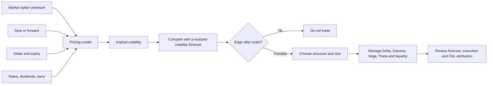
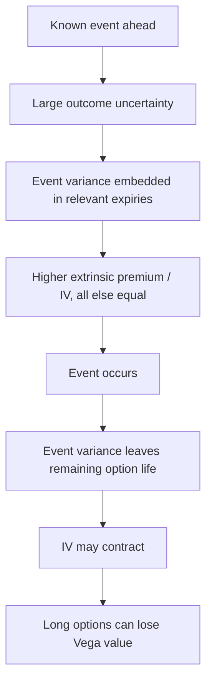
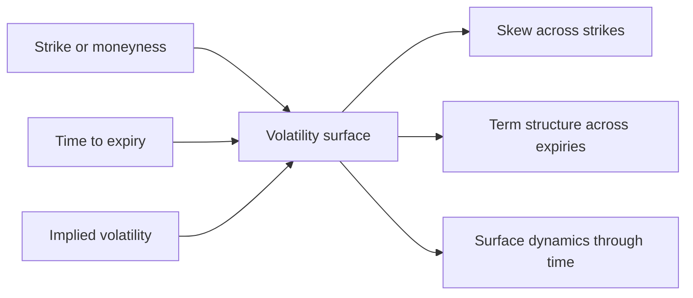
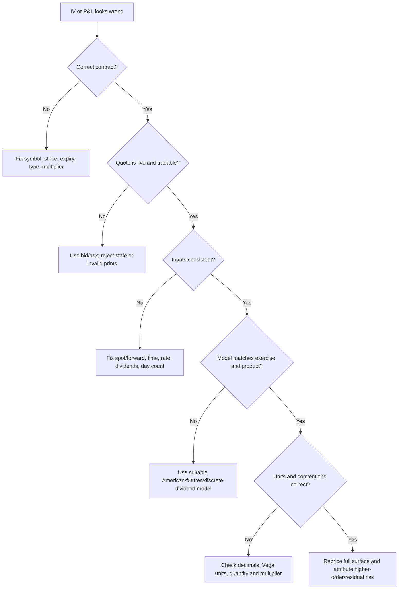

# Volatility Trading — Euan Sinclair

## Why This Chapter Matters

A stock trader mainly asks, “Which direction will the underlying move?” A volatility trader must ask a harder set of questions:

1. How much movement is already embedded in the option price?
2. How much movement is likely to occur during the option's remaining life?
3. How will the path of that movement interact with hedging, time decay, skew, and transaction costs?
4. Is the difference large enough to survive model error and execution costs?

This changes the mental model:

```text
Directional trading:  forecast direction

Volatility trading:   forecast magnitude and path of movement
                      compare that forecast with the option's price
                      manage the resulting Greeks and execution costs
```

The option-pricing model is therefore not an oracle that reveals the “correct” premium. It is a **translation and risk-accounting system**. It converts premiums with different strikes and expiries into comparable quantities such as implied volatility and Greeks.

## The Big Picture



The causal chain is:

**Uncertain future price path → contingent option payoff → option premium → model-implied volatility → comparison with forecast realized volatility → position and hedge choice → path-dependent P&L.**

## Core Vocabulary

| Term | Precise working meaning | Why it matters |
|---|---|---|
| **Option premium** | The price at which the option can currently be bought or sold | This is observable, but bid and ask may differ substantially |
| **Intrinsic value** | Immediate exercise value: `max(S − K, 0)` for a call and `max(K − S, 0)` for a put, subject to contract conventions | Volatility changes extrinsic value, not the already-existing intrinsic payoff |
| **Extrinsic value** | Premium above intrinsic value | Reflects time, uncertainty, rates, dividends/carry, skew, and supply-demand effects |
| **Realized volatility (RV)** | A statistic calculated from actual returns over an observed period | Backward-looking when measured; it can also be forecast for a future period |
| **Implied volatility (IV)** | The volatility input that makes a selected pricing model reproduce a selected market premium | A model-dependent price coordinate, not directly observed volatility |
| **Variance** | Volatility squared, `σ²` | Variance is additive across time under cleaner assumptions than volatility itself |
| **Greek** | A local sensitivity of model value to one input | Helps attribute and control risk, but is not a guarantee |
| **Skew / smile** | Variation of IV across strikes or moneyness for one expiry | Shows that the market does not price every strike with one constant volatility |
| **Term structure** | Variation of IV across expiries | Reveals how uncertainty is distributed through time |
| **Volatility surface** | IV indexed by strike/moneyness and expiry | The fuller state description used to compare options |
| **Volatility risk premium** | Broadly, compensation embedded in option prices for bearing volatility/tail risk | Helps explain why implied and subsequently realized volatility need not match on average |

## Mental Model: BSM Is a Language, Not the Market

Black–Scholes–Merton (BSM) matters because raw option premiums are difficult to compare.

- A premium of ₹100 may be expensive for a two-day option and cheap for a six-month option.
- A ₹100 premium on a ₹500 underlying is not comparable with ₹100 on a ₹25,000 underlying.
- Deep in-the-money premium contains substantial intrinsic value; at-the-money premium is mostly extrinsic.

The model normalizes these differences. Traders can discuss “20% implied volatility” across strikes and expiries more coherently than they can compare unrelated currency premiums.

The model can be used in two directions:

```text
Forward valuation

Assumed volatility + contract inputs
                ↓
          pricing model
                ↓
       theoretical option value
```

```text
Inverse problem

Observed option premium + other contract inputs
                ↓
     numerically invert the model
                ↓
          implied volatility
```

This inversion is what an IV figure represents.

## Black–Scholes–Merton from First Principles

### The problem that existed

An option has a nonlinear terminal payoff, but its value changes before expiry with the underlying price, remaining time, and changing uncertainty. Merely forecasting the underlying's average return does not provide a consistent way to value and hedge this payoff.

The BSM insight was to construct a dynamically hedged portfolio and apply no-arbitrage reasoning. In the idealized model, the option's local directional exposure can be offset using the underlying. The instantaneously hedged portfolio should then earn the risk-free rate; otherwise an arbitrage would exist.

```text
Nonlinear option payoff
        ↓
Measure local stock sensitivity (Delta)
        ↓
Offset Delta with the tradable underlying
        ↓
Idealized portfolio becomes locally direction-neutral
        ↓
No-arbitrage links its return to the risk-free rate
        ↓
Pricing equation and hedge ratios
```

### Inputs

For a European-style option with a continuous dividend yield or analogous carry input:

```text
Option value = f(S, K, τ, r, q, σ, option type)
```

where:

| Symbol | Meaning |
|---|---|
| `S` | Current underlying price |
| `K` | Strike price |
| `τ` | Time remaining to expiry, expressed in years |
| `r` | Continuously compounded risk-free rate used by the model |
| `q` | Continuous dividend yield or relevant carry adjustment |
| `σ` | Annualized volatility input |

The original draft omitted dividends/carry. That omission can materially distort equity and index option IV, especially over longer expiries.

### European call and put formulas

For reference:

$$
C = S e^{-q\tau}N(d_1)-K e^{-r\tau}N(d_2)
$$

$$
P = K e^{-r\tau}N(-d_2)-S e^{-q\tau}N(-d_1)
$$

with

$$
d_1=\frac{\ln(S/K)+(r-q+\tfrac{1}{2}\sigma^2)\tau}{\sigma\sqrt{\tau}},
\qquad
d_2=d_1-\sigma\sqrt{\tau}.
$$

`N(·)` is the standard normal cumulative distribution function.

The formulas are less important than the structure: option value comes from a discounted, probability-weighted nonlinear payoff under the model's no-arbitrage framework.

## Model Assumptions and Their Consequences

BSM deliberately simplifies reality. The relevant question is not “Is the model true?” It is “Where is the approximation useful, and where can it fail?”

| Idealized assumption | Real-market violation | Practical consequence |
|---|---|---|
| Tradable underlying and continuous rebalancing | Markets trade discretely; gaps occur | A Delta hedge cannot remove jump or between-hedge risk |
| No transaction costs or bid–ask spread | Every hedge and option trade costs money | Frequent hedging can consume the apparent edge |
| Unlimited borrowing/lending at one constant rate | Funding rates differ and change | Carry and financing P&L can depart from the model |
| Short selling is frictionless | Borrow may be costly, restricted, or recalled | Put/call relationships and hedges may be distorted |
| Underlying is divisible and liquid | Lot sizes, market impact, and thin books exist | Exact hedges may be impossible or expensive |
| Constant volatility | Volatility changes and clusters | Vega, skew, and term-structure risk become central |
| Continuous lognormal price process | Returns have jumps, heavy tails, and asymmetry | Far-tail options do not fit one flat volatility |
| European exercise | Some contracts allow early exercise | American-option valuation needs an early-exercise model |
| Known dividends/carry | Actual dividends or carry can surprise | Incorrect forwards produce incorrect IV and Delta |

Important nuance: dividends are not simply proof that “Black–Scholes cannot be used.” The framework can incorporate known continuous yield, discrete-dividend approximations, or forward prices. The implementation and contract must match.

## Implied Volatility

### What IV actually says

Suppose a pricing model with the current contract inputs returns the observed premium when `σ = 20%`. Then:

> The selected model requires an annualized volatility input of approximately 20% to reproduce the selected option price.

That is the safest definition.

An IV of 20% does **not** by itself mean:

- the underlying will rise by 20%;
- the underlying will remain within a 20% range;
- realized volatility will equal 20%;
- there is a stated probability of profit;
- the option is cheap or expensive;
- the market has a directional forecast.

Volatility describes magnitude, not direction. IV is also shaped by risk premia, tail demand, supply-demand imbalance, liquidity, model inputs, and the chosen strike/expiry. Treating it as a pure, unbiased forecast is too strong.

### A rough time-scale translation

If annualized volatility is 20% and the convention uses 252 trading days:

$$
\text{one-day volatility} \approx \frac{20\%}{\sqrt{252}} \approx 1.26\%.
$$

For `T` years, the common square-root-of-time heuristic is:

$$
\text{volatility over horizon }T \approx \sigma\sqrt{T}.
$$

For an underlying at ₹25,000, 20% annualized volatility over 30 calendar days gives the rough one-standard-deviation scale

$$
25{,}000 \times 0.20 \times \sqrt{30/365} \approx ₹1{,}434.
$$

This is a **scale estimate**, not a guaranteed range and not automatically the market's quoted straddle-implied move. The result changes with day-count convention, distributional assumptions, skew, and whether the horizon uses calendar or trading time.

### IV is obtained numerically

There is no elementary closed-form inverse of the BSM formula for volatility. Software normally uses a root-finding method:

```text
Choose a trial σ
      ↓
Calculate model premium
      ↓
Compare with observed premium
      ↓
Adjust σ and repeat until the pricing error is small
```

No stable IV may be available when the quote is stale, the bid/ask is nonsensical, the option violates no-arbitrage bounds, time to expiry is wrong, or the chosen model is inappropriate. Deep in-the-money or near-expiry options can also have very low Vega, making the inversion numerically unstable.

## Realized Volatility

### Close-to-close estimator

Given prices `P₀, P₁, …, Pₙ`, first calculate log returns:

$$
r_t=\ln\left(\frac{P_t}{P_{t-1}}\right).
$$

A common annualized sample-volatility estimate is:

$$
\hat{\sigma}_{RV}
=
\sqrt{A}
\sqrt{\frac{1}{n-1}\sum_{t=1}^{n}(r_t-\bar r)^2},
$$

where `A` is the annualization factor, often 252 for daily equity returns.

This number depends on choices that are easy to hide:

- sampling interval;
- lookback window;
- close-to-close versus intraday estimator;
- treatment of overnight returns and missing observations;
- corporate-action adjustments;
- annualization convention;
- whether the mean return is removed.

Therefore “realized volatility was 18%” is incomplete unless the measurement method and window are stated.

### Why forecasting RV is difficult

Volatility is not constant. It tends to cluster: calm periods follow calm periods, while turbulent periods often remain turbulent for a while. Yet regime changes, jumps, and events can invalidate a backward-looking estimate.

```text
Recent returns + range data + event information + regime context
                              ↓
                    volatility forecast
                              ↓
               uncertainty around that forecast
```

A responsible forecast is a distribution or range, not a falsely precise point estimate. Moving averages, exponentially weighted estimates, GARCH-family models, range-based estimators, implied measures, and event-specific analysis each emphasize different information.

## The Core Volatility-Trade Comparison

The simplified trading question is:

```text
Forecast future realized volatility
                versus
Volatility implied by the option price
```

But `forecast RV > IV` does not mechanically mean “buy options,” and `forecast RV < IV` does not mechanically mean “sell options.” A complete comparison also requires:

- strike-specific skew and expiry-specific term structure;
- the path and timing of movement;
- expected IV changes before exit;
- hedging frequency and transaction costs;
- bid–ask spreads and market impact;
- jumps and gap risk;
- model error;
- funding, taxes, margin, and settlement;
- position sizing and tail survival.

The better causal chain is:

**Forecasting edge → appropriate option structure → achievable execution → disciplined hedge rule → costs and path dependency → realized P&L.**

## How Option P&L Moves

### Correct local approximation

For small changes over a short interval, a second-order approximation is:

$$
\Delta V
\approx
\Delta\,\Delta S
+\frac{1}{2}\Gamma(\Delta S)^2
+\text{Vega}\,\Delta\sigma
+\Theta\,\Delta t
+\text{Rho}\,\Delta r
+\text{higher-order and residual effects}.
$$

This corrects two common mistakes:

1. A Greek must be multiplied by the corresponding input change.
2. The Greek already carries a sign. Do not automatically write “minus Theta.” A platform's long-option Theta is usually negative, so `Theta × elapsed time` already produces a loss under that convention.

The approximation is local. Large moves, multiple simultaneous input changes, a moving volatility surface, jumps, discrete hedging, and time near expiry can create a large residual.

### Greek risk map

| Greek | Local sensitivity | Typical long vanilla option sign | What can invalidate a simple reading |
|---|---|---|---|
| **Delta** | Change in option value for a small change in underlying price | Call: positive; put: negative | Delta itself changes with spot, time, and IV |
| **Gamma** | Change in Delta for a change in underlying price | Positive | Becomes highly path-sensitive near expiry; discrete gaps cannot be continuously hedged |
| **Vega** | Change in option value for an IV change | Positive | IV may move differently at each strike and expiry |
| **Theta** | Change in option value as time passes | Usually negative | Not linear; sign can differ for some positions and conventions |
| **Rho** | Change in option value for a rate change | Depends on option type/position | Forward, dividends, and funding may matter more than a single rate Greek suggests |

For a portfolio, calculate **net position Greeks**, not one leg in isolation. A spread can be long Vega at one expiry and short Vega at another; one number may hide curve risk.

### Why correct direction can still lose money

Assume a trader buys a call before an event. The underlying rises, but less than the option market had priced, time passes, and IV falls sharply.

```text
Positive Delta contribution
          +
Positive Gamma contribution
          -
Negative Theta contribution
          -
Negative Vega contribution from IV crush
          -
Bid–ask spread and charges
          =
Possibly negative total P&L
```

The accurate conclusion is:

> Correct direction is only one component of option P&L. The move must also be sufficiently large and timely relative to what was priced, unless favorable volatility or other effects compensate.

### Vega example—with the convention stated

Suppose:

```text
Option premium = ₹200
Vega = ₹10 per 1 volatility point
IV = 18%
```

If IV moves from 18% to 19%, the local Vega estimate is:

$$
\Delta V_{vega}\approx ₹10\times 1=+₹10.
$$

If IV moves from 18% to 17%, the estimate is approximately `−₹10`, other inputs held constant.

Always verify the platform's convention. Some systems report Vega per **one percentage-point** IV move, while mathematical libraries may report sensitivity to a **1.00 decimal** volatility move. Confusing `0.01` with `1.00` produces a 100× error.

## Gamma, Theta, and Delta-Hedged Volatility Exposure

A long vanilla option is generally long Gamma and pays for that convexity through premium and usually negative Theta. If the trader repeatedly Delta-hedges, favorable underlying movement can generate rebalancing gains; insufficient movement leaves the trader paying decay and costs.

Under restrictive BSM-style assumptions, a Delta-hedged option's local P&L is often motivated by:

$$
d\Pi
\approx
\frac{1}{2}\Gamma S^2
\left(\sigma_{realized}^2-\sigma_{implied}^2\right)dt,
$$

before transaction costs and other model errors.

The intuition is valuable:

```text
Long Gamma
    ↓
Benefit from sufficiently large realized movement and rehedging
    ↓
Theta and premium are the cost of owning convexity
    ↓
Profit only if harvested movement exceeds priced movement and frictions
```

Do not turn the equation into a guarantee. Real P&L depends on discrete hedge timing, jumps, the exact path, changing IV/skew, execution prices, rates/carry, and how `realized` and `implied` variance are defined.

## Event Volatility and “IV Crush”

Before a scheduled event, an option expiry containing that event often embeds both ordinary daily variance and event variance:

$$
\text{total variance to expiry}
\approx
\text{ordinary variance}
+
\text{event variance}.
$$

As the event approaches, uncertainty can raise the relevant options' premiums and IV. Once the event occurs, its uncertainty is no longer part of the remaining life, so IV and extrinsic value may fall. This is the mechanism commonly called **IV crush**.



Important qualifications:

- IV does not always rise before every event.
- It does not always collapse afterward; the event may create new uncertainty.
- The nearest expiry containing the event may react more than later expiries.
- Higher option demand is one possible force, but dealer inventory, supply, liquidity, and expected jump risk also affect prices.
- A large realized jump can overwhelm IV crush and still make a long option profitable.
- Comparing pre-event IV with post-event IV alone ignores the actual premium paid and realized move.

## Volatility Smile, Skew, Term Structure, and Surface

### Why a flat volatility fails

If one constant-volatility BSM model described all options perfectly, options on the same underlying and expiry would map to roughly one IV after consistent inputs. Real markets show different IVs across strikes.

Synthetic illustration only:

| NIFTY strike | Option side shown | Illustrative IV |
|---:|:---:|---:|
| 24,000 | Put | 24% |
| 24,200 | Put | 22% |
| 24,400 | Put | 20% |
| 24,600 | Put | 18% |
| 24,800 | Near ATM | 16% |
| 25,000 | Call | 15% |
| 25,200 | Call | 14% |
| 25,400 | Call | 14% |

This downward-sloping pattern is an example of **negative equity-index skew**: downside options carry higher IV than upside options. It can reflect crash/tail risk, persistent demand for downside protection, leverage effects, and dealer inventory/risk constraints.

Do not infer a free trade merely because one strike has higher IV. Different strikes contain different tail exposure and must be compared on a risk-adjusted, executable basis.

### Three dimensions



- **Smile/skew:** IV across strikes for one expiry.
- **Term structure:** comparable IV across expiries.
- **Surface:** both dimensions together.

For comparisons through time, raw strike can mislead because spot moves. Traders often use forward moneyness, log-moneyness, or Delta. These choices are not interchangeable and can make the observed “smile dynamics” look different.

### The surface moves

A surface is not a static lookup table. When spot moves, both IV levels and relative skew can change. A position can therefore have:

- parallel Vega exposure;
- skew exposure;
- term-structure exposure;
- correlation exposure in index versus component options;
- second-order exposure such as Vanna and Volga/Vomma.

“I am Vega-neutral” is incomplete if the position is exposed to a twist of the surface.

## Practical Analysis Workflow

### 1. Define the hypothesis

Write a falsifiable statement:

```text
Bad:  IV looks high.

Better:  The 30-day at-the-money implied variance is above my forecast
         distribution for realized variance by enough to cover the bid–ask
         spread, hedge costs, event risk, and forecast uncertainty.
```

### 2. Validate the contract and data

- Underlying and contract multiplier
- European or American exercise
- Cash or physical settlement
- Expiry timestamp and holiday calendar
- Spot versus futures/forward input
- Rate and dividend/carry assumptions
- Live bid, ask, size, volume, and open interest
- Corporate-action or index-rebalancing effects

### 3. Inspect the entire relevant surface

Do not analyze one IV in isolation. Compare:

- neighboring strikes;
- earlier and later expiries;
- call and put consistency;
- current surface with its own history;
- known events inside each expiry;
- bid IV, ask IV, and mid IV—not only last-traded IV.

### 4. Forecast realized volatility with uncertainty

Use more than one reasonable estimator when possible. Record the lookback, sampling rule, regime assumptions, and event adjustments. Keep a forecast range and identify what would invalidate it.

### 5. Translate view into a structure

The structure must match the actual view:

| View | Possible educational structure | Main hidden risk |
|---|---|---|
| Higher magnitude of movement, direction unknown | Long straddle/strangle | Premium, Theta, event IV crush, wide wings |
| Lower movement than priced | Defined-risk short-volatility spread | Gap/tail loss, skew, margin and liquidity |
| Relative skew mispricing | Risk reversal or vertical comparison | Directional Delta and crash exposure |
| Relative expiry mispricing | Calendar/diagonal | Term-structure and cross-expiry Vega mismatch |
| Direction plus limited loss | Long option or debit spread | Move may be too small/slow; IV can fall |

This table names structures for study; it is not a recommendation.

### 6. Specify risk before entry

- Maximum acceptable loss and gap scenario
- Net Greeks at entry and under stress
- Spot/IV/time scenario grid
- Hedge trigger or no-hedge rule
- Exit, expiry, and event rules
- Liquidity and slippage assumptions
- Portfolio overlap with other positions
- Size small enough to survive forecast error

### 7. Attribute P&L after exit

Separate, as far as the tooling permits:

```text
Delta + Gamma/rehedging + Vega/surface + Theta/carry
+ fees + spread/slippage + model residual
```

Then ask whether profit came from the forecast, accidental direction, a lucky volatility move, or under-recorded risk. A profitable trade can still be a bad process; a controlled losing trade can still provide useful evidence.

## Failure Modes, Mistakes, and Traps

### Conceptual traps

- **“High IV means the market will fall.”** Volatility has no direction.
- **“IV is the market's exact forecast.”** IV is a model-implied price coordinate containing premia and frictions.
- **“IV 20 means a 20% move is expected.”** It is normally an annualized volatility input, not a terminal-move prediction.
- **“Direction was correct, so the option should profit.”** Magnitude, timing, IV, Theta, and execution also matter.
- **“Long options have limited risk, so position size can be large.”** A 100% premium loss can still be portfolio-damaging.
- **“Option sellers win because Theta is positive.”** Short convexity can accumulate small gains and then suffer a large gap loss.
- **“High IV means expensive.”** Expensive relative to what forecast, surface point, event, and executable price?
- **“Vega-neutral means volatility-neutral.”** Surface twists, skew, term structure, and second-order Greeks remain.

### Data and implementation traps

- Using last trade rather than a live bid/ask midpoint
- Calculating IV from a crossed, zero, or extremely wide market
- Wrong expiry time or day-count convention
- Ignoring dividends, futures basis, or carry
- Mixing 18% with decimal `0.18`
- Mixing Vega per one vol point with Vega per 100 vol points
- Comparing different expiries without converting volatility to variance
- Using unadjusted prices across a split or corporate action
- Treating an illiquid far-OTM option's printed IV as reliable
- Applying European BSM blindly to an American option with early-exercise value
- Forgetting lot multiplier when converting per-unit Greeks into position risk

## Debugging an Implausible IV or P&L



Useful checks:

1. Confirm intrinsic value and basic no-arbitrage bounds.
2. Recompute with bid, mid, and ask to obtain an IV interval.
3. Check call–put parity using consistent carry assumptions.
4. Compare with neighboring strikes and expiries.
5. Recalculate time to the exact expiry instant.
6. Check whether Vega is near zero, making inversion unstable.
7. Reconcile per-unit P&L with contract multiplier and quantity.
8. Use a scenario revaluation rather than a first-order Greek estimate after a large move.

## Small Details That Matter Later

1. **Volatility points are percentage points.** A move from 18% to 19% is one vol point, but a 5.56% relative increase.
2. **Volatility is annualized.** The annualization factor and calendar/trading-day convention must be documented.
3. **Variance, not volatility, is the cleaner time-additive quantity.** Event and ordinary variances are often combined before taking a square root.
4. **IV belongs to an option/model pair.** The underlying itself does not literally have a single implied volatility; an index such as VIX aggregates information using a defined methodology.
5. **The quote side matters.** A long trade is entered near the ask and exited near the bid, not magically at every midpoint.
6. **The option multiplier matters.** A quoted Greek per unit must be multiplied by contract multiplier and position quantity.
7. **Gamma and Theta accelerate near expiry.** A near-expiry option can change character faster than a daily risk report suggests.
8. **Far-OTM IV can be unstable.** Tiny price changes can create large IV changes, especially with wide tick sizes.
9. **Spot IV and forward IV are different views.** A steep term structure may hide an event-rich interval between expiries.
10. **Calls and puts should be compared consistently.** Same-strike European calls and puts are linked by put–call parity; inconsistent rates, dividends, or quotes create artificial IV differences.
11. **Skew convention must be named.** Strike, moneyness, log-moneyness, and Delta-based skew can tell different-looking stories.
12. **Greeks are snapshots.** They change after spot, time, or IV changes; they are not fixed coefficients for the life of the trade.
13. **Theta is convention-sensitive.** Platforms may quote per calendar day, trading day, or annual unit.
14. **India-specific contract rules change.** Verify current NSE/exchange circulars for expiry day, settlement, exercise, taxes, and margins rather than relying on an old note.
15. **A backtest needs executable historical option data.** Reconstructing option P&L from underlying candles and a constant IV assumption is not evidence of a tradable edge.

## Common Misunderstandings Rewritten Correctly

| Weak statement | Better statement |
|---|---|
| Higher volatility always raises “the option” | Holding other inputs fixed, higher model volatility generally raises the value of a standard long call or put through extrinsic value |
| IV is an indicator | IV is the model parameter inferred from an option price; an indicator may summarize IV but is not IV itself |
| BSM solved backward gives market expectation | Model inversion gives model-implied volatility; interpreting it as expectation requires additional assumptions |
| Theta is subtracted from P&L | Theta is a signed sensitivity multiplied by elapsed time under a stated convention |
| Event uncertainty falls, so IV must crash | Removal of event variance often reduces IV, but new information and remaining uncertainty can prevent or reverse the decline |
| Different strike IVs prove BSM is useless | They show that constant volatility is insufficient; BSM IV remains a useful quoting and risk language |

## Book Roadmap

The second edition's progression is useful because it moves from model language to measurement, forecasting, execution, and evaluation:

1. Option Pricing
2. Volatility Measurement
3. Stylized Facts about Returns and Volatility
4. Volatility Forecasting
5. Implied Volatility Dynamics
6. Hedging
7. Distribution of Hedged Option Positions
8. Money Management
9. Trade Evaluation
10. Psychology
11. Generating Returns through Volatility
12. The VIX
13. Leveraged ETFs
14. Life Cycle of a Trade
15. Conclusion

The most useful learning order for this vault is:

**payoff and intrinsic/extrinsic value → BSM as a model language → realized versus implied volatility → Delta → Gamma/Theta relationship → Vega → skew and term structure → hedging and costs → sizing → trade evaluation.**

## Connected Notes

- [[../../foundations/Financial Jargon Glossary|Financial Jargon Glossary]]
- [[../../strategies/Positional Trader|Positional Trader]]
- [[../../governance/misunderstanding_register|Misunderstanding Register]]
- [[../../workbooks/professional_trading_workbook_methodology|Professional Trading Workbook Methodology]]

## Chapter Summary

- Option premiums depend on spot/forward, strike, remaining time, rates, dividends/carry, volatility, and contract features.
- BSM is best treated as a common translation and risk language, not a literal description of all market behavior.
- Implied volatility is backed out from an option premium using a chosen model. It is not a direction forecast or guaranteed realized volatility.
- A volatility trade compares the volatility/variance priced by options with a forecast of what will be realized, after allowing for skew, path, hedging, liquidity, costs, and tail risk.
- Option P&L is a sum of signed, changing exposures. Correct direction alone is insufficient.
- Real markets require a volatility surface because IV varies by strike and expiry.
- Edge without execution discipline, risk sizing, and post-trade attribution is not a trading process.

## Questions to Test Understanding

1. Why is a raw option premium a poor comparison tool across strikes and expiries?
2. What exactly does “20% implied volatility” mean?
3. Why is IV not automatically an unbiased forecast of realized volatility?
4. Write the local option P&L approximation and explain why “minus Theta” is not universally correct notation.
5. How can a call buyer lose even when the underlying rises?
6. What is the difference between realized volatility, implied volatility, skew, and term structure?
7. Why can a deep in-the-money option return an unstable IV?
8. Why should event variance be reasoned about in variance rather than volatility units?
9. What does a Delta-hedged long-Gamma position need to overcome?
10. Why is “high IV” not, by itself, a short-option signal?
11. What five inputs would you check first if two platforms show different IVs?
12. Why can a position be net Vega-neutral but still exposed to volatility-surface movement?

## Answers and Reasoning

1. Premium mixes scale, intrinsic value, time, carry, and nonlinear payoff. A model-implied volatility normalizes many of these differences into a more comparable coordinate.
2. It means the chosen pricing model reproduces the chosen market premium when its annualized volatility input is set near 20%, given the other inputs.
3. IV contains risk premia, tail demand, liquidity and model effects. It represents a price under a pricing framework, not a pure statistical expectation.
4. `ΔV ≈ Delta·ΔS + ½Gamma·(ΔS)² + Vega·Δσ + Theta·Δt + Rho·Δr + residual`. Theta already has a sign under the quoting convention.
5. The positive Delta/Gamma contribution may be smaller than Theta decay, an IV-crush loss, spread, and charges; the rise may also be too small or too late.
6. RV is calculated from actual returns; IV is inverted from option prices; skew compares IV across strikes for one expiry; term structure compares IV across expiries.
7. Most of its value may be intrinsic, leaving little volatility-sensitive value. Low Vega means a tiny premium error can imply a large volatility error.
8. Independent variance contributions can be added more naturally. Adding volatility percentages directly usually gives the wrong total.
9. Theta/premium cost, transaction costs, spread, hedge slippage, funding, jumps, and model error. The realized path must provide enough rehedging gain after these costs.
10. The high level may correctly compensate for jump and tail risk. A short option also has nonlinear loss and margin/liquidity risk. “High” requires a forecast and historical/structural context.
11. Contract/expiry, live premium side, exact time remaining, spot versus forward, and rate/dividend/carry assumptions. Model type and units follow immediately.
12. Vega can be offset only for a chosen local movement. Skew can steepen, one expiry can move independently, or the surface can twist, leaving cross-strike and cross-expiry exposure.

## Glossary

| Term | Short definition |
|---|---|
| **Annualization** | Scaling a horizon-specific volatility estimate to a one-year convention |
| **Convexity** | Curvature that makes option value respond nonlinearly to underlying movement |
| **Delta hedging** | Trading the underlying to offset some or all of an option position's current Delta |
| **Forward moneyness** | Strike measured relative to the relevant forward rather than current spot |
| **IV crush** | A sharp fall in IV, commonly—but not inevitably—after an event resolves |
| **Log return** | `ln(Pₜ/Pₜ₋₁)`, commonly used in volatility estimation |
| **Model residual** | P&L not explained by the chosen Greek approximation and recorded inputs |
| **Risk-neutral distribution** | Pricing distribution consistent with no-arbitrage and market prices; not the same as a real-world forecast distribution |
| **Volatility point** | One percentage point of volatility, such as 18% to 19% |
| **Vanna** | Sensitivity linking Delta and volatility; commonly described as change in Delta with IV |
| **Volga / Vomma** | Curvature of option value with respect to volatility |

## Sources and Verification Notes

Concepts were checked on **2026-08-12**. Product rules and market conventions remain version- and venue-sensitive.

1. Euan Sinclair, [_Volatility Trading_, Second Edition](https://onlinelibrary.wiley.com/doi/book/10.1002/9781118662724), Wiley, 2013 — official book record and chapter structure.
2. Fischer Black and Myron Scholes, [“The Pricing of Options and Corporate Liabilities”](https://doi.org/10.1086/260062), _Journal of Political Economy_, 1973 — original no-arbitrage option-pricing paper.
3. Options Industry Council, [Volatility & the Greeks](https://www.optionseducation.org/advancedconcepts/volatility-the-greeks) — model inputs, historical/implied volatility, and Greek conventions.
4. Options Industry Council, [Understanding Options Greeks](https://www.optionseducation.org/advancedconcepts/understanding-options-greeks) — Greeks as local theoretical guideposts rather than guaranteed price changes.
5. Options Industry Council, [Understanding Volatility and Options Skew](https://www.optionseducation.org/news/april-webinar-key-takeaways-understanding-volatility-and-options-skew) — IV, skew, term structure, and surface terminology.
